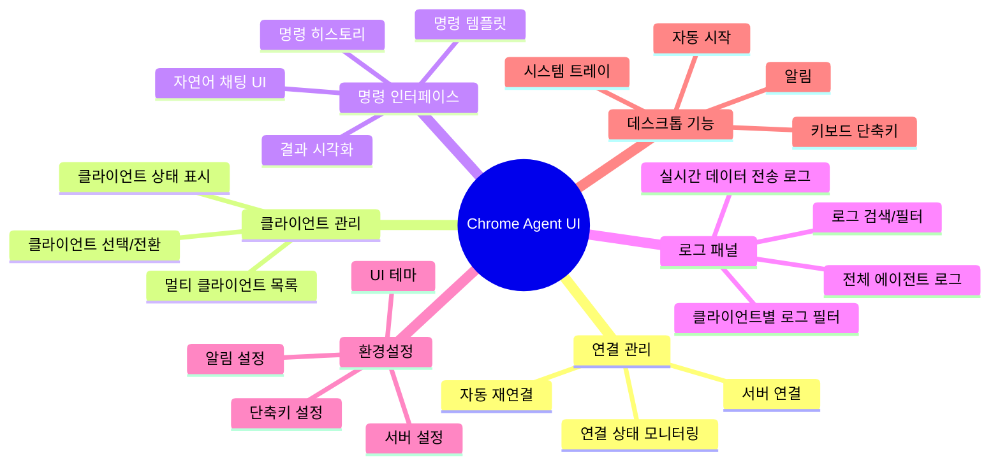
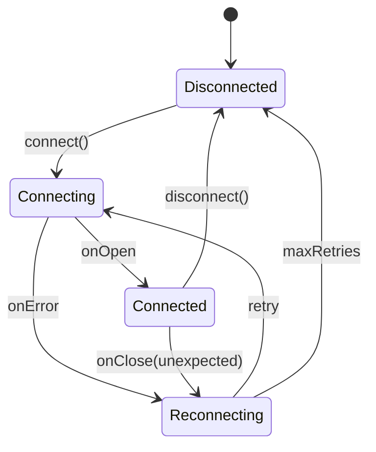

# Chrome Agent UI PRD (Product Requirements Document)

> **문서 버전:** 1.0
> **작성일:** 2025-01-11
> **상태:** Draft

---

## 1. 개요

### 1.1 프로젝트 배경 및 목적

Chrome Agent UI는 Chrome Agent 시스템의 **데스크톱 클라이언트 애플리케이션**입니다. 기존 웹 기반 MVP(`agent-web/`)를 Electron 기반 데스크톱 애플리케이션으로 확장하여, **멀티 클라이언트 관리**, **고급 환경설정**, **향상된 사용자 경험**을 제공합니다.

### 1.2 핵심 가치 제안

| 항목 | 설명 |
|------|------|
| **멀티 클라이언트** | 여러 Chrome Extension 클라이언트를 동시에 관리 |
| **데스크톱 경험** | 시스템 트레이, 알림, 키보드 단축키 등 네이티브 기능 |
| **향상된 UI** | 복잡한 데이터 시각화 및 관리 인터페이스 |
| **오프라인 지원** | 로컬 히스토리 저장 및 오프라인 설정 관리 |

### 1.3 대상 사용자

- 웹 자동화 작업이 필요한 개발자
- QA 엔지니어
- 데이터 수집/분석 담당자
- 웹 스크래핑 자동화가 필요한 사용자

---

## 2. 시스템 아키텍처

### 2.1 전체 구성도

```
┌─────────────────────────────────────────────────────────────────────────────┐
│                           Chrome Agent UI (Electron)                         │
├─────────────────────────────────────────────────────────────────────────────┤
│                                                                              │
│  ┌──────────────────┐    ┌──────────────────────────────────────────────┐  │
│  │   Main Process   │    │              Renderer Process                 │  │
│  │                  │    │                                               │  │
│  │  ┌────────────┐  │    │  ┌─────────────────────────────────────────┐ │  │
│  │  │   IPC      │◄─┼────┼─►│              React App                  │ │  │
│  │  │  Handler   │  │    │  │                                         │ │  │
│  │  └────────────┘  │    │  │  ┌─────────┐ ┌─────────┐ ┌───────────┐ │ │  │
│  │                  │    │  │  │Sidebar  │ │Main View│ │Settings   │ │ │  │
│  │  ┌────────────┐  │    │  │  │(Clients)│ │(Chat UI)│ │Panel      │ │ │  │
│  │  │  System    │  │    │  │  └─────────┘ └─────────┘ └───────────┘ │ │  │
│  │  │  Tray      │  │    │  │                                         │ │  │
│  │  └────────────┘  │    │  │  ┌─────────────────────────────────────┐│ │  │
│  │                  │    │  │  │          State Management           ││ │  │
│  │  ┌────────────┐  │    │  │  │         (Zustand Store)             ││ │  │
│  │  │  Storage   │  │    │  │  └─────────────────────────────────────┘│ │  │
│  │  │  (SQLite)  │  │    │  └─────────────────────────────────────────┘ │  │
│  │  └────────────┘  │    │                                               │  │
│  └──────────────────┘    └──────────────────────────────────────────────┘  │
│                                                                              │
└─────────────────────────────────────────────────────────────────────────────┘
                                      │
                                      │ WebSocket
                                      ▼
                    ┌─────────────────────────────────────┐
                    │        Netty WebSocket Server       │
                    │                                     │
                    │   Session Manager  │  AI Service    │
                    └─────────────────────────────────────┘
                                      │
              ┌───────────────────────┼───────────────────────┐
              │                       │                       │
              ▼                       ▼                       ▼
     ┌─────────────────┐    ┌─────────────────┐    ┌─────────────────┐
     │ Chrome Ext #1   │    │ Chrome Ext #2   │    │ Chrome Ext #N   │
     │   (Client A)    │    │   (Client B)    │    │   (Client N)    │
     └─────────────────┘    └─────────────────┘    └─────────────────┘
```

### 2.2 기술 스택

| 레이어 | 기술 | 선택 이유 |
|--------|------|-----------|
| **Runtime** | Electron 28+ | 크로스 플랫폼 데스크톱 앱, Node.js API 접근 |
| **UI Framework** | React 19 | 컴포넌트 기반 UI, 풍부한 생태계 |
| **Language** | TypeScript 5.x | 타입 안전성, 개발 생산성 |
| **Build Tool** | Vite + electron-vite | 빠른 HMR, 최적화된 빌드 |
| **State Management** | Zustand | 경량, 간단한 API, React 통합 |
| **Styling** | TailwindCSS 4 + shadcn/ui | 유틸리티 기반, 일관된 디자인 시스템 |
| **Data Fetching** | TanStack Query | 서버 상태 관리, 캐싱 |
| **Local Storage** | better-sqlite3 | 경량 로컬 DB, 히스토리 저장 |
| **Packaging** | electron-builder | 멀티 플랫폼 빌드 및 배포 |
| **IPC** | electron-trpc (optional) | 타입 안전한 IPC 통신 |

### 2.3 의존성 목록

```json
{
  "dependencies": {
    "react": "^19.2.0",
    "react-dom": "^19.2.0",
    "zustand": "^5.0.0",
    "@tanstack/react-query": "^5.x",
    "clsx": "^2.x",
    "tailwind-merge": "^2.x",
    "lucide-react": "^0.400.0",
    "date-fns": "^3.x",
    "better-sqlite3": "^11.x",
    "electron-store": "^10.x"
  },
  "devDependencies": {
    "electron": "^33.x",
    "electron-vite": "^2.x",
    "electron-builder": "^25.x",
    "@types/react": "^19.x",
    "@types/better-sqlite3": "^7.x",
    "typescript": "^5.9.x",
    "vite": "^7.x",
    "tailwindcss": "^4.x",
    "@tailwindcss/vite": "^4.x"
  }
}
```

---

## 3. 기능 명세

### 3.1 기능 개요



### 3.2 상세 기능 명세

#### 3.2.1 연결 관리 (Connection Management)

| 기능 | 설명 | 우선순위 |
|------|------|----------|
| 서버 연결 | WebSocket을 통한 서버 연결 관리 | P0 |
| 자동 재연결 | 연결 끊김 시 자동 재연결 (최대 5회, 지수 백오프) | P0 |
| 연결 상태 표시 | 실시간 연결 상태 시각적 표시 | P0 |
| 수동 연결/해제 | 사용자가 수동으로 연결 제어 | P1 |
| 다중 서버 프로필 | 여러 서버 설정 저장 및 전환 | P2 |

**상태 다이어그램:**



---

#### 3.2.2 멀티 클라이언트 관리 (Multi-Client Management)

Chrome Extension 클라이언트를 여러 개 동시에 관리할 수 있습니다.

| 기능 | 설명 | 우선순위 |
|------|------|----------|
| 클라이언트 목록 | 연결된 모든 클라이언트 표시 | P0 |
| 클라이언트 상태 | 각 클라이언트의 연결/페어링 상태 표시 | P0 |
| 클라이언트 선택 | 특정 클라이언트 선택하여 명령 전송 | P0 |
| 클라이언트 별명 | 클라이언트에 사용자 정의 이름 지정 | P1 |
| 클라이언트 그룹화 | 클라이언트를 그룹으로 관리 | P2 |
| 브로드캐스트 | 여러 클라이언트에 동시 명령 전송 | P2 |

**클라이언트 데이터 모델:**

```typescript
interface Client {
  id: string;                    // 고유 식별자
  sessionId: string;             // 서버 세션 ID
  name: string;                  // 사용자 정의 이름
  status: ClientStatus;          // 연결 상태
  lastActive: Date;              // 마지막 활동 시간
  metadata: {
    browser: string;             // 브라우저 정보
    currentUrl?: string;         // 현재 페이지 URL
    currentTitle?: string;       // 현재 페이지 제목
  };
}

type ClientStatus =
  | 'connecting'
  | 'connected'
  | 'paired'
  | 'disconnected'
  | 'error';
```

---

#### 3.2.3 명령 인터페이스 (Command Interface)

자연어 기반 채팅 UI를 통해 브라우저 자동화 명령을 전송합니다.

| 기능 | 설명 | 우선순위 |
|------|------|----------|
| 채팅 UI | 대화형 메시지 인터페이스 | P0 |
| 명령 전송 | 자연어 명령 서버로 전송 | P0 |
| 결과 표시 | 명령 실행 결과 포맷팅하여 표시 | P0 |
| 실행 상태 | 명령 처리 진행 상태 표시 | P0 |
| 명령 히스토리 | 이전 명령/결과 저장 및 조회 | P1 |
| 결과 복사 | JSON/텍스트 형식으로 결과 복사 | P1 |
| 결과 내보내기 | CSV, JSON 파일로 내보내기 | P1 |
| 명령 템플릿 | 자주 쓰는 명령 저장 및 재사용 | P2 |
| 명령 자동완성 | 명령어 자동 완성 제안 | P2 |

**메시지 데이터 모델:**

```typescript
interface ChatMessage {
  id: string;
  clientId: string;              // 대상 클라이언트
  type: 'user' | 'ai' | 'system' | 'error';
  content: string;
  timestamp: Date;
  status?: MessageStatus;
  data?: unknown;                // 결과 데이터
  error?: ErrorInfo;
}

type MessageStatus =
  | 'sending'
  | 'processing'
  | 'executing'
  | 'success'
  | 'error'
  | 'timeout';
```

---

#### 3.2.4 환경설정 (Settings)

애플리케이션의 다양한 설정을 관리합니다.

| 카테고리 | 설정 항목 | 타입 | 기본값 |
|----------|-----------|------|--------|
| **서버** | 서버 URL | string | `ws://localhost:8080/ws` |
| | 자동 연결 | boolean | true |
| | 재연결 최대 시도 | number | 5 |
| | 재연결 간격(초) | number | 5 |
| | Heartbeat 간격(초) | number | 10 |
| **UI** | 테마 | 'light' \| 'dark' \| 'system' | 'system' |
| | 언어 | 'ko' \| 'en' | 'ko' |
| | 폰트 크기 | number | 14 |
| | 사이드바 위치 | 'left' \| 'right' | 'left' |
| **알림** | 데스크톱 알림 | boolean | true |
| | 사운드 알림 | boolean | false |
| | 연결 상태 알림 | boolean | true |
| | 명령 완료 알림 | boolean | true |
| **데스크톱** | 시스템 트레이 | boolean | true |
| | 시작 시 최소화 | boolean | false |
| | 시스템 시작 시 자동 실행 | boolean | false |
| **단축키** | 명령 전송 | string | 'Ctrl+Enter' |
| | 새 대화 | string | 'Ctrl+N' |
| | 설정 열기 | string | 'Ctrl+,' |

**설정 저장소:**

```typescript
// electron-store를 사용한 설정 관리
interface AppSettings {
  server: ServerSettings;
  ui: UISettings;
  notifications: NotificationSettings;
  desktop: DesktopSettings;
  shortcuts: ShortcutSettings;
}
```

---

#### 3.2.5 데이터 전송 로그 패널 (Log Panel)

실시간 WebSocket 데이터 전송 로그를 오른쪽 사이드 패널에서 모니터링합니다.

| 기능 | 설명 | 우선순위 |
|------|------|----------|
| 실시간 로그 스트림 | WebSocket 메시지 송수신 실시간 표시 | P0 |
| 로그 타입 필터 | 메시지 타입별 필터링 (COMMAND, RESPONSE, CHAT 등) | P0 |
| 클라이언트별 필터 | 특정 클라이언트 로그만 표시 | P0 |
| 전체 로그 뷰 | 클라이언트 미선택 시 전체 에이전트 로그 표시 | P0 |
| 로그 검색 | 텍스트 기반 로그 검색 | P1 |
| 로그 상세 보기 | 로그 항목 클릭 시 페이로드 상세 표시 | P1 |
| 로그 복사/내보내기 | 선택한 로그 복사 또는 파일 내보내기 | P1 |
| 로그 일시정지 | 자동 스크롤 일시정지/재개 | P1 |
| 시간 필터 | 특정 시간 범위 로그 필터링 | P2 |
| 로그 레벨 | 정보/경고/오류 레벨 구분 표시 | P2 |

**로그 표시 모드:**

| 모드 | 조건 | 표시 내용 |
|------|------|-----------|
| **클라이언트 로그** | 클라이언트 선택됨 | 해당 클라이언트의 데이터 전송 로그만 표시 |
| **전체 로그** | 클라이언트 미선택 (비활성화) | 모든 에이전트의 로그 통합 표시 |

**로그 엔트리 데이터 모델:**

```typescript
interface LogEntry {
  id: string;
  timestamp: Date;
  direction: 'inbound' | 'outbound';  // 수신/송신
  type: MessageType;                   // CONNECT, CHAT, COMMAND, RESPONSE 등
  clientId?: string;                   // 클라이언트 ID (전체 로그 시)
  clientName?: string;                 // 클라이언트 이름
  messageId: string;                   // WebSocket 메시지 ID
  summary: string;                     // 로그 요약 (한 줄)
  payload: unknown;                    // 전체 메시지 페이로드
  level: LogLevel;                     // 로그 레벨
}

type LogLevel = 'info' | 'success' | 'warning' | 'error';

type LogFilter = {
  types?: MessageType[];              // 메시지 타입 필터
  clientIds?: string[];               // 클라이언트 필터
  direction?: 'inbound' | 'outbound' | 'all';
  level?: LogLevel[];
  search?: string;                    // 검색어
  timeRange?: {
    start: Date;
    end: Date;
  };
};
```

**로그 패널 상태:**

```typescript
interface LogPanelState {
  isOpen: boolean;                    // 패널 표시 여부
  isPaused: boolean;                  // 자동 스크롤 일시정지
  filter: LogFilter;                  // 현재 필터 설정
  selectedLogId: string | null;       // 상세 보기 중인 로그
  maxEntries: number;                 // 최대 보관 로그 수 (기본 1000)
}
```

---

#### 3.2.6 데스크톱 기능 (Desktop Features)

Electron 기반 네이티브 기능을 제공합니다.

| 기능 | 설명 | 우선순위 |
|------|------|----------|
| 시스템 트레이 | 트레이 아이콘 및 컨텍스트 메뉴 | P1 |
| 데스크톱 알림 | 네이티브 알림 표시 | P1 |
| 글로벌 단축키 | 앱이 백그라운드일 때도 동작 | P2 |
| 자동 업데이트 | electron-updater 기반 자동 업데이트 | P2 |
| 딥 링크 | `chrome-agent://` 프로토콜 처리 | P3 |

---

### 3.3 기능 우선순위 정의

| 우선순위 | 설명 | 대상 버전 |
|----------|------|-----------|
| **P0** | 핵심 기능, 없으면 앱이 동작하지 않음 | v1.0 |
| **P1** | 중요 기능, 사용자 경험에 큰 영향 | v1.0 |
| **P2** | 편의 기능, 있으면 좋음 | v1.1 |
| **P3** | 부가 기능, 향후 고려 | v2.0+ |

---

## 4. UI/UX 설계

### 4.1 전체 레이아웃

```
┌─────────────────────────────────────────────────────────────────────────────────────────────────────────┐
│  ◀ ▶  Chrome Agent                                                              🔔  ⚙️  ─ □ ✕         │ Title Bar
├─────────────────────────────────────────────────────────────────────────────────────────────────────────┤
│ ┌──────────┐ ┌───────────────────────────────────────────────────┐ ┌──────────────────────────────────┐│
│ │          │ │                                                   │ │ 📋 LOG PANEL        [⏸] [✕]    ││
│ │ CLIENTS  │ │  Client: Chrome #1                   🟢 Connected│ ├──────────────────────────────────┤│
│ │          │ │  URL: https://example.com                        │ │ Filter: [All Types ▼] [🔍 검색] ││
│ │ ┌──────┐ │ ├───────────────────────────────────────────────────┤ ├──────────────────────────────────┤│
│ │ │🟢 #1 │◄┼─┤                                                   │ │                                  ││
│ │ └──────┘ │ │  ┌───────────────────────────────────────────┐   │ │ 10:30:15.123 ▶ CHAT             ││
│ │ ┌──────┐ │ │  │ 👤 User                       10:30 AM    │   │ │ #1 → Server                      ││
│ │ │🟢 #2 │ │ │  │ 현재 페이지의 쿠키를 추출해줘               │   │ │ "현재 페이지의 쿠키를..."        ││
│ │ └──────┘ │ │  └───────────────────────────────────────────┘   │ │ ─────────────────────────────────││
│ │ ┌──────┐ │ │                                                   │ │ 10:30:15.234 ◀ COMMAND          ││ Log
│ │ │🔴 #3 │ │ │  ┌───────────────────────────────────────────┐   │ │ Server → #1                      ││ Panel
│ │ └──────┘ │ │  │ 🤖 AI                         10:30 AM    │   │ │ EXTRACT_COOKIES                  ││
│ │          │ │  │ 쿠키 정보를 추출했습니다.                   │   │ │ ─────────────────────────────────││
│ │          │ │  │                                            │   │ │ 10:30:15.456 ◀ RESPONSE  ✓      ││
│ │ ───────  │ │  │ 📋 결과 (3개 쿠키)                         │   │ │ #1 → Server                      ││
│ │          │ │  │ ┌────────────────────────────────────────┐│   │ │ success: 3 cookies              ││
│ │ + 새 연결 │ │  │ │ session_id: abc123...                 ││   │ │ ─────────────────────────────────││
│ │          │ │  │ │ auth_token: xyz789...                 ││   │ │                                  ││
│ │          │ │  │ └────────────────────────────────────────┘│   │ │                                  ││
│ │          │ │  │                          [복사] [내보내기] │   │ │                                  ││
│ │          │ │  └───────────────────────────────────────────┘   │ │                                  ││
│ │          │ │                                                   │ │                                  ││
│ │          │ ├───────────────────────────────────────────────────┤ │                                  ││
│ │          │ │ ┌──────────────────────────────────────┐         │ │                                  ││
│ │          │ │ │ 메시지를 입력하세요...                 │    ➤   │ │ [로그 내보내기] [로그 지우기]      ││
│ │          │ │ └──────────────────────────────────────┘         │ └──────────────────────────────────┘│
│ └──────────┘ └───────────────────────────────────────────────────┘                                    │
├─────────────────────────────────────────────────────────────────────────────────────────────────────────┤
│ 🟢 Server Connected │ ⏱️ 150ms │ 💬 3 messages │ 📋 12 logs                                            │ Status Bar
└─────────────────────────────────────────────────────────────────────────────────────────────────────────┘
```

**클라이언트 미선택 시 (전체 로그 뷰):**

```
┌─────────────────────────────────────────────────────────────────────────────────────────────────────────┐
│  ◀ ▶  Chrome Agent                                                              🔔  ⚙️  ─ □ ✕         │ Title Bar
├─────────────────────────────────────────────────────────────────────────────────────────────────────────┤
│ ┌──────────┐ ┌───────────────────────────────────────────────────┐ ┌──────────────────────────────────┐│
│ │          │ │                                                   │ │ 📋 ALL AGENTS LOG    [⏸] [✕]    ││
│ │ CLIENTS  │ │                                                   │ ├──────────────────────────────────┤│
│ │          │ │        클라이언트를 선택해주세요                    │ │ Filter: [All ▼] [All Types ▼]   ││
│ │ ┌──────┐ │ │                                                   │ ├──────────────────────────────────┤│
│ │ │🟢 #1 │ │ │        좌측 목록에서 클라이언트를 선택하면          │ │                                  ││
│ │ └──────┘ │ │        해당 클라이언트와 대화할 수 있습니다         │ │ 10:30:12 [#1] ▶ CONNECT         ││
│ │ ┌──────┐ │ │                                                   │ │ Agent → Server                   ││
│ │ │🟢 #2 │ │ │                                                   │ │ ─────────────────────────────────││
│ │ └──────┘ │ │                     📭                            │ │ 10:30:12 [#1] ◀ CONNECT_ACK     ││
│ │ ┌──────┐ │ │                                                   │ │ Server → Agent (session: abc123) ││
│ │ │🔴 #3 │ │ │                                                   │ │ ─────────────────────────────────││
│ │ └──────┘ │ │                                                   │ │ 10:30:13 [#2] ▶ CONNECT         ││
│ │          │ │                                                   │ │ Agent → Server                   ││
│ │          │ │                                                   │ │ ─────────────────────────────────││
│ │ ───────  │ │                                                   │ │ 10:30:15 [#1] ▶ CHAT            ││
│ │          │ │                                                   │ │ "현재 페이지의 쿠키를..."        ││
│ │ + 새 연결 │ │                                                   │ │ ─────────────────────────────────││
│ │          │ │                                                   │ │ 10:30:15 [#1] ◀ COMMAND         ││
│ │          │ │                                                   │ │ EXTRACT_COOKIES                  ││
│ │          │ │                                                   │ │                                  ││
│ │          │ │                                                   │ │                                  ││
│ │          │ │                                                   │ │ [로그 내보내기] [로그 지우기]      ││
│ └──────────┘ └───────────────────────────────────────────────────┘ └──────────────────────────────────┘│
├─────────────────────────────────────────────────────────────────────────────────────────────────────────┤
│ 🟢 Server Connected │ 3 Clients │ 📋 24 logs (All Agents)                                              │ Status Bar
└─────────────────────────────────────────────────────────────────────────────────────────────────────────┘
```

### 4.2 레이아웃 구성 요소

| 영역 | 설명 | 크기 |
|------|------|------|
| **Title Bar** | 윈도우 제어, 앱 이름, 알림/설정 버튼 | 고정 32px |
| **Sidebar (Left)** | 클라이언트 목록, 연결 추가 버튼 | 리사이즈 가능 (180-300px) |
| **Header** | 선택된 클라이언트 정보, 연결 상태 | 고정 60px |
| **Chat Area** | 메시지 목록, 스크롤 가능 | 가변 (flex-1) |
| **Input Area** | 메시지 입력, 전송 버튼 | 고정 80px |
| **Log Panel (Right)** | 실시간 데이터 전송 로그 | 리사이즈 가능 (300-500px), 토글 가능 |
| **Status Bar** | 서버 상태, 응답 시간, 메시지 수, 로그 수 | 고정 28px |

### 4.3 로그 패널 상세 UI

#### 4.3.1 로그 패널 헤더

```
┌──────────────────────────────────────────────┐
│ 📋 LOG PANEL                    [⏸] [◀] [✕] │  ← 일시정지 / 접기 / 닫기
├──────────────────────────────────────────────┤
│ [All Types ▼] [Direction ▼] [🔍 검색...]    │  ← 필터 컨트롤
└──────────────────────────────────────────────┘
```

**필터 드롭다운 옵션:**

| 필터 | 옵션 |
|------|------|
| **Type** | All, CONNECT, CHAT, COMMAND, RESPONSE, ERROR, HEARTBEAT |
| **Direction** | All, Inbound (◀), Outbound (▶) |
| **Client** (전체 로그 시) | All, Client #1, Client #2, ... |

#### 4.3.2 로그 엔트리 형식

```
┌──────────────────────────────────────────────┐
│ 10:30:15.123  ▶ CHAT                    ⓘ   │  ← 시간 / 방향 / 타입 / 상세보기
│ #1 Chrome → Server                          │  ← 소스 → 타겟
│ "현재 페이지의 쿠키를 추출해줘"               │  ← 요약 (1줄)
└──────────────────────────────────────────────┘
```

**로그 레벨별 색상:**

| 레벨 | 색상 | 사용처 |
|------|------|--------|
| `info` | 회색 | CONNECT, HEARTBEAT |
| `success` | 녹색 | CONNECT_ACK, 성공 RESPONSE |
| `warning` | 노란색 | 재연결, 타임아웃 경고 |
| `error` | 빨간색 | ERROR, 실패 RESPONSE |

#### 4.3.3 로그 상세 뷰 (클릭 시)

```
┌──────────────────────────────────────────────┐
│ 📋 Log Detail                          [✕]  │
├──────────────────────────────────────────────┤
│ Time:      2025-01-11 10:30:15.123          │
│ Direction: Outbound (▶)                     │
│ Type:      CHAT                             │
│ MessageId: abc123-def456-...                │
│ Client:    Chrome #1 (session: xyz789)      │
├──────────────────────────────────────────────┤
│ Payload:                                     │
│ ┌────────────────────────────────────────┐  │
│ │ {                                      │  │
│ │   "messageId": "abc123...",            │  │
│ │   "type": "CHAT",                      │  │
│ │   "source": "agent",                   │  │
│ │   "target": "server",                  │  │
│ │   "payload": {                         │  │
│ │     "text": "현재 페이지의 쿠키를..."   │  │
│ │   }                                    │  │
│ │ }                                      │  │
│ └────────────────────────────────────────┘  │
│                              [복사] [닫기]   │
└──────────────────────────────────────────────┘
```

### 4.4 화면별 설계

#### 4.4.1 메인 화면 (Main View)

**상태별 표시:**

| 상태 | 표시 내용 |
|------|-----------|
| 연결 전 | "서버에 연결해주세요" + 연결 버튼 |
| 연결 중 | 로딩 스피너 + "연결 중..." |
| 연결됨, 클라이언트 없음 | "크롬 확장을 연결해주세요" |
| 클라이언트 연결됨 | 채팅 UI 표시 |
| 오류 | 오류 메시지 + 재시도 버튼 |

---

#### 4.4.2 설정 화면 (Settings View)

```
┌────────────────────────────────────────────────────────────────────────────┐
│  ← Settings                                                                │
├────────────────────────────────────────────────────────────────────────────┤
│ ┌────────────────┐ ┌──────────────────────────────────────────────────────┐│
│ │                │ │                                                      ││
│ │  > Server      │ │  Server Settings                                     ││
│ │    UI          │ │  ────────────────────────────────────────────────    ││
│ │    Notifications│ │                                                      ││
│ │    Desktop     │ │  Server URL                                          ││
│ │    Shortcuts   │ │  ┌──────────────────────────────────────────────┐   ││
│ │    About       │ │  │ ws://localhost:8080/ws                       │   ││
│ │                │ │  └──────────────────────────────────────────────┘   ││
│ │                │ │                                                      ││
│ │                │ │  ☑ Auto-connect on startup                          ││
│ │                │ │                                                      ││
│ │                │ │  Reconnect Settings                                  ││
│ │                │ │  ────────────────────────────────────────────────    ││
│ │                │ │                                                      ││
│ │                │ │  Max Retries        Retry Interval                   ││
│ │                │ │  ┌────────┐         ┌────────┐                       ││
│ │                │ │  │   5    │         │   5s   │                       ││
│ │                │ │  └────────┘         └────────┘                       ││
│ │                │ │                                                      ││
│ └────────────────┘ └──────────────────────────────────────────────────────┘│
├────────────────────────────────────────────────────────────────────────────┤
│                                        [Reset to Defaults]  [Save Changes] │
└────────────────────────────────────────────────────────────────────────────┘
```

---

### 4.5 테마 시스템

```typescript
// 테마 색상 정의
interface ThemeColors {
  // Background
  bgPrimary: string;
  bgSecondary: string;
  bgTertiary: string;

  // Text
  textPrimary: string;
  textSecondary: string;
  textMuted: string;

  // Accent
  accent: string;
  accentHover: string;

  // Status
  success: string;
  warning: string;
  error: string;
  info: string;

  // Border
  border: string;
  borderHover: string;
}
```

**Light Theme:**
- 배경: White (#FFFFFF), Gray-50 (#F9FAFB)
- 텍스트: Gray-900 (#111827)
- 악센트: Blue-500 (#3B82F6)

**Dark Theme:**
- 배경: Gray-900 (#111827), Gray-800 (#1F2937)
- 텍스트: Gray-100 (#F3F4F6)
- 악센트: Blue-400 (#60A5FA)

---

## 5. 컴포넌트 구조

### 5.1 디렉토리 구조

```
agent-ui/
├── electron/                        # Electron 메인 프로세스
│   ├── main.ts                      # 메인 진입점
│   ├── preload.ts                   # Preload 스크립트
│   ├── ipc/                         # IPC 핸들러
│   │   ├── index.ts
│   │   ├── settings.ts
│   │   └── storage.ts
│   └── services/
│       ├── tray.ts                  # 시스템 트레이
│       ├── notification.ts          # 알림 서비스
│       └── database.ts              # SQLite 연결
│
├── src/                             # Renderer 프로세스 (React)
│   ├── main.tsx                     # React 진입점
│   ├── App.tsx                      # 루트 컴포넌트
│   │
│   ├── components/
│   │   ├── ui/                      # shadcn/ui 기반 공통 컴포넌트
│   │   │   ├── Button.tsx
│   │   │   ├── Input.tsx
│   │   │   ├── Select.tsx
│   │   │   ├── Dialog.tsx
│   │   │   ├── Toast.tsx
│   │   │   ├── Tooltip.tsx
│   │   │   ├── ScrollArea.tsx
│   │   │   └── ...
│   │   │
│   │   ├── layout/                  # 레이아웃 컴포넌트
│   │   │   ├── AppLayout.tsx        # 전체 레이아웃
│   │   │   ├── TitleBar.tsx         # 커스텀 타이틀바
│   │   │   ├── Sidebar.tsx          # 사이드바 컨테이너
│   │   │   ├── MainContent.tsx      # 메인 콘텐츠 영역
│   │   │   └── StatusBar.tsx        # 상태바
│   │   │
│   │   ├── sidebar/                 # 사이드바 관련
│   │   │   ├── ClientList.tsx       # 클라이언트 목록
│   │   │   ├── ClientItem.tsx       # 클라이언트 아이템
│   │   │   └── AddClientButton.tsx  # 새 연결 버튼
│   │   │
│   │   ├── chat/                    # 채팅 UI 컴포넌트
│   │   │   ├── ChatContainer.tsx    # 채팅 컨테이너
│   │   │   ├── ChatHeader.tsx       # 채팅 헤더
│   │   │   ├── MessageList.tsx      # 메시지 목록
│   │   │   ├── MessageBubble.tsx    # 메시지 버블
│   │   │   ├── MessageContent.tsx   # 메시지 내용 렌더링
│   │   │   ├── ResultViewer.tsx     # 결과 데이터 뷰어
│   │   │   ├── InputArea.tsx        # 입력 영역
│   │   │   └── TypingIndicator.tsx  # 타이핑 인디케이터
│   │   │
│   │   ├── settings/                # 설정 관련
│   │   │   ├── SettingsDialog.tsx   # 설정 다이얼로그
│   │   │   ├── SettingsNav.tsx      # 설정 네비게이션
│   │   │   ├── ServerSettings.tsx   # 서버 설정
│   │   │   ├── UISettings.tsx       # UI 설정
│   │   │   ├── NotificationSettings.tsx
│   │   │   └── ShortcutSettings.tsx
│   │   │
│   │   ├── log-panel/               # 로그 패널 컴포넌트
│   │   │   ├── LogPanel.tsx         # 로그 패널 컨테이너
│   │   │   ├── LogPanelHeader.tsx   # 헤더 (필터, 검색, 컨트롤)
│   │   │   ├── LogList.tsx          # 로그 목록 (가상화)
│   │   │   ├── LogEntry.tsx         # 개별 로그 엔트리
│   │   │   ├── LogDetailDialog.tsx  # 로그 상세 다이얼로그
│   │   │   ├── LogFilter.tsx        # 필터 드롭다운
│   │   │   └── LogSearch.tsx        # 검색 입력
│   │   │
│   │   └── common/                  # 공통 컴포넌트
│   │       ├── StatusIndicator.tsx  # 상태 표시기
│   │       ├── Spinner.tsx          # 로딩 스피너
│   │       ├── EmptyState.tsx       # 빈 상태 표시
│   │       └── ErrorBoundary.tsx    # 에러 바운더리
│   │
│   ├── hooks/                       # 커스텀 훅
│   │   ├── useWebSocket.ts          # WebSocket 연결 관리
│   │   ├── useClients.ts            # 클라이언트 관리
│   │   ├── useSettings.ts           # 설정 관리
│   │   ├── useTheme.ts              # 테마 관리
│   │   ├── useShortcuts.ts          # 단축키 관리
│   │   ├── useIPC.ts                # Electron IPC 통신
│   │   ├── useLogPanel.ts           # 로그 패널 상태/액션
│   │   └── useLogFilter.ts          # 로그 필터링 로직
│   │
│   ├── stores/                      # Zustand 상태 관리
│   │   ├── connectionStore.ts       # 연결 상태
│   │   ├── clientStore.ts           # 클라이언트 상태
│   │   ├── chatStore.ts             # 채팅 메시지 상태
│   │   ├── logStore.ts              # 로그 패널 상태 및 로그 데이터
│   │   ├── settingsStore.ts         # 설정 상태
│   │   └── uiStore.ts               # UI 상태 (사이드바, 다이얼로그 등)
│   │
│   ├── services/                    # 서비스 레이어
│   │   ├── websocket.ts             # WebSocket 서비스
│   │   ├── storage.ts               # 로컬 스토리지 서비스
│   │   └── notification.ts          # 알림 서비스
│   │
│   ├── types/                       # TypeScript 타입 정의
│   │   ├── index.ts
│   │   ├── client.ts
│   │   ├── message.ts
│   │   ├── settings.ts
│   │   └── electron.d.ts            # Electron API 타입
│   │
│   ├── utils/                       # 유틸리티 함수
│   │   ├── format.ts                # 포맷팅 유틸
│   │   ├── cn.ts                    # className 유틸 (clsx + tailwind-merge)
│   │   └── date.ts                  # 날짜 유틸
│   │
│   └── styles/
│       └── globals.css              # 전역 스타일 (Tailwind)
│
├── resources/                       # 정적 리소스
│   ├── icon.png                     # 앱 아이콘
│   ├── icon.ico                     # Windows 아이콘
│   └── icon.icns                    # macOS 아이콘
│
├── electron-builder.json            # electron-builder 설정
├── electron.vite.config.ts          # electron-vite 설정
├── package.json
├── tsconfig.json
├── tsconfig.node.json
└── tailwind.config.ts
```

### 5.2 핵심 컴포넌트 명세

#### 5.2.1 AppLayout

전체 애플리케이션 레이아웃을 담당합니다.

```tsx
interface AppLayoutProps {
  children?: React.ReactNode;
}

// 구조
<AppLayout>
  <TitleBar />
  <div className="flex flex-1">
    <Sidebar />              {/* 왼쪽: 클라이언트 목록 */}
    <MainContent>            {/* 중앙: 채팅 UI */}
      {children}
    </MainContent>
    <LogPanel />             {/* 오른쪽: 로그 패널 (토글 가능) */}
  </div>
  <StatusBar />
</AppLayout>
```

---

#### 5.2.2 ChatContainer

선택된 클라이언트와의 채팅 UI를 담당합니다.

```tsx
interface ChatContainerProps {
  clientId: string;
}

// 상태
- messages: ChatMessage[]
- isLoading: boolean
- currentExecution: ExecutionStatus

// 기능
- 메시지 목록 표시
- 메시지 전송
- 자동 스크롤
- 결과 데이터 표시
```

---

#### 5.2.3 ResultViewer

명령 실행 결과를 시각적으로 표시합니다.

```tsx
interface ResultViewerProps {
  data: unknown;
  type: 'cookies' | 'dom' | 'form' | 'pageInfo' | 'unknown';
}

// 기능
- JSON 트리 뷰어
- 테이블 형식 표시
- 복사 버튼
- 내보내기 버튼 (JSON, CSV)
- 축소/확장 토글
```

---

#### 5.2.4 LogPanel

실시간 데이터 전송 로그를 표시하는 오른쪽 사이드 패널입니다.

```tsx
interface LogPanelProps {
  className?: string;
}

// 상태 (logStore에서 관리)
- entries: LogEntry[]           // 로그 엔트리 목록
- filter: LogFilter             // 현재 필터 설정
- isPaused: boolean             // 자동 스크롤 일시정지
- selectedLogId: string | null  // 상세 보기 중인 로그

// 기능
- 실시간 로그 스트리밍 (WebSocket 메시지 수신 시 자동 추가)
- 타입/방향/클라이언트별 필터링
- 텍스트 검색
- 가상화된 리스트 (react-window 또는 @tanstack/react-virtual)
- 자동 스크롤 (새 로그 시 하단으로)
- 일시정지/재개 토글
- 로그 클릭 시 상세 다이얼로그
- 로그 내보내기 (JSON/CSV)
```

**LogEntry 컴포넌트:**

```tsx
interface LogEntryProps {
  entry: LogEntry;
  isSelected: boolean;
  onClick: () => void;
}

// 표시 요소
- 타임스탬프 (HH:mm:ss.SSS)
- 방향 아이콘 (▶ outbound, ◀ inbound)
- 메시지 타입 뱃지 (CHAT, COMMAND, RESPONSE 등)
- 클라이언트 식별자 (전체 로그 모드 시)
- 요약 텍스트 (1줄)
- 레벨별 색상 구분
```

**LogDetailDialog 컴포넌트:**

```tsx
interface LogDetailDialogProps {
  entry: LogEntry;
  isOpen: boolean;
  onClose: () => void;
}

// 표시 요소
- 전체 타임스탬프
- 메시지 ID
- 소스/타겟 정보
- 클라이언트 정보
- 전체 페이로드 (JSON 포맷팅, 구문 강조)
- 복사 버튼
```

---

### 5.3 상태 관리 구조

```typescript
// stores/connectionStore.ts
interface ConnectionState {
  status: ConnectionStatus;
  serverUrl: string;
  sessionId: string | null;
  reconnectAttempts: number;
  lastError: string | null;

  // Actions
  connect: () => Promise<void>;
  disconnect: () => void;
  setStatus: (status: ConnectionStatus) => void;
}

// stores/clientStore.ts
interface ClientState {
  clients: Client[];
  selectedClientId: string | null;

  // Actions
  addClient: (client: Client) => void;
  removeClient: (clientId: string) => void;
  updateClient: (clientId: string, updates: Partial<Client>) => void;
  selectClient: (clientId: string | null) => void;
}

// stores/chatStore.ts
interface ChatState {
  messagesByClient: Record<string, ChatMessage[]>;
  currentExecution: ExecutionStatus;

  // Actions
  addMessage: (clientId: string, message: ChatMessage) => void;
  updateMessage: (clientId: string, messageId: string, updates: Partial<ChatMessage>) => void;
  clearMessages: (clientId: string) => void;
  setCurrentExecution: (status: ExecutionStatus) => void;
}

// stores/logStore.ts
interface LogState {
  // 로그 데이터
  entries: LogEntry[];                           // 전체 로그 엔트리
  filteredEntries: LogEntry[];                   // 필터링된 로그 (캐싱)

  // 패널 상태
  isOpen: boolean;                               // 패널 표시 여부
  isPaused: boolean;                             // 자동 스크롤 일시정지
  selectedLogId: string | null;                  // 상세 보기 중인 로그

  // 필터 설정
  filter: LogFilter;

  // 설정
  maxEntries: number;                            // 최대 로그 수 (기본 1000)

  // Actions
  addLog: (entry: Omit<LogEntry, 'id'>) => void; // 새 로그 추가
  clearLogs: () => void;                         // 로그 초기화
  setFilter: (filter: Partial<LogFilter>) => void; // 필터 설정
  togglePanel: () => void;                       // 패널 토글
  togglePause: () => void;                       // 일시정지 토글
  selectLog: (logId: string | null) => void;     // 로그 선택 (상세 보기)
  exportLogs: (format: 'json' | 'csv') => void;  // 로그 내보내기
}

// stores/settingsStore.ts
interface SettingsState {
  settings: AppSettings;

  // Actions
  updateSettings: (updates: Partial<AppSettings>) => void;
  resetToDefaults: () => void;
  loadSettings: () => Promise<void>;
  saveSettings: () => Promise<void>;
}
```

---

## 6. 데이터 모델

### 6.1 로컬 데이터베이스 스키마

SQLite를 사용하여 히스토리 및 설정을 로컬에 저장합니다.

```sql
-- 메시지 히스토리
CREATE TABLE messages (
    id TEXT PRIMARY KEY,
    client_id TEXT NOT NULL,
    type TEXT NOT NULL,           -- 'user' | 'ai' | 'system' | 'error'
    content TEXT NOT NULL,
    data TEXT,                    -- JSON serialized
    status TEXT,
    created_at DATETIME DEFAULT CURRENT_TIMESTAMP
);

-- 클라이언트 정보
CREATE TABLE clients (
    id TEXT PRIMARY KEY,
    name TEXT,
    last_session_id TEXT,
    last_active DATETIME,
    metadata TEXT,                -- JSON serialized
    created_at DATETIME DEFAULT CURRENT_TIMESTAMP
);

-- 명령 템플릿
CREATE TABLE templates (
    id TEXT PRIMARY KEY,
    name TEXT NOT NULL,
    content TEXT NOT NULL,
    category TEXT,
    created_at DATETIME DEFAULT CURRENT_TIMESTAMP
);
```

### 6.2 WebSocket 메시지 타입

기존 프로토콜을 그대로 사용하되, 멀티 클라이언트 지원을 위한 확장이 필요합니다.

```typescript
// 서버로 보내는 메시지에 targetClientId 추가 가능
interface WSMessage {
  messageId: string;
  timestamp?: string;
  type: MessageType;
  source: 'agent' | 'extension' | 'server';
  target: 'agent' | 'extension' | 'server';
  targetClientId?: string;       // 특정 클라이언트 지정 (멀티 클라이언트)
  payload?: Record<string, unknown>;
  requestId?: string;
}
```

---

## 7. IPC 통신 설계

### 7.1 Main ↔ Renderer 통신

```typescript
// electron/preload.ts
contextBridge.exposeInMainWorld('electronAPI', {
  // Settings
  getSettings: () => ipcRenderer.invoke('settings:get'),
  setSettings: (settings: AppSettings) => ipcRenderer.invoke('settings:set', settings),

  // Storage
  saveMessage: (message: ChatMessage) => ipcRenderer.invoke('storage:saveMessage', message),
  getMessages: (clientId: string, limit?: number) => ipcRenderer.invoke('storage:getMessages', clientId, limit),

  // Window
  minimize: () => ipcRenderer.send('window:minimize'),
  maximize: () => ipcRenderer.send('window:maximize'),
  close: () => ipcRenderer.send('window:close'),

  // Notifications
  showNotification: (title: string, body: string) => ipcRenderer.send('notification:show', title, body),

  // Events
  onSettingsChanged: (callback: (settings: AppSettings) => void) => {
    ipcRenderer.on('settings:changed', (_, settings) => callback(settings));
  },
});

// types/electron.d.ts
interface ElectronAPI {
  getSettings: () => Promise<AppSettings>;
  setSettings: (settings: AppSettings) => Promise<void>;
  saveMessage: (message: ChatMessage) => Promise<void>;
  getMessages: (clientId: string, limit?: number) => Promise<ChatMessage[]>;
  minimize: () => void;
  maximize: () => void;
  close: () => void;
  showNotification: (title: string, body: string) => void;
  onSettingsChanged: (callback: (settings: AppSettings) => void) => void;
}

declare global {
  interface Window {
    electronAPI: ElectronAPI;
  }
}
```

---

## 8. 빌드 및 배포

### 8.1 빌드 스크립트

```json
{
  "scripts": {
    "dev": "electron-vite dev",
    "build": "electron-vite build",
    "preview": "electron-vite preview",
    "package": "electron-builder",
    "package:win": "electron-builder --win",
    "package:mac": "electron-builder --mac",
    "package:linux": "electron-builder --linux"
  }
}
```

### 8.2 electron-builder 설정

```json
{
  "appId": "com.chromeagent.desktop",
  "productName": "Chrome Agent",
  "directories": {
    "output": "release"
  },
  "files": [
    "out/**/*"
  ],
  "win": {
    "target": [
      {
        "target": "nsis",
        "arch": ["x64"]
      },
      {
        "target": "portable",
        "arch": ["x64"]
      }
    ],
    "icon": "resources/icon.ico"
  },
  "mac": {
    "target": ["dmg", "zip"],
    "icon": "resources/icon.icns"
  },
  "linux": {
    "target": ["AppImage", "deb"],
    "icon": "resources/icon.png"
  },
  "nsis": {
    "oneClick": false,
    "allowToChangeInstallationDirectory": true
  }
}
```

### 8.3 배포 체크리스트

- [ ] Windows 인스톨러 (NSIS)
- [ ] Windows Portable
- [ ] macOS DMG
- [ ] Linux AppImage
- [ ] 코드 서명 (Windows, macOS)
- [ ] 자동 업데이트 설정

---

## 9. 보안 고려사항

### 9.1 Electron 보안 설정

```typescript
// electron/main.ts
const mainWindow = new BrowserWindow({
  webPreferences: {
    nodeIntegration: false,           // Node.js 직접 접근 비활성화
    contextIsolation: true,           // 컨텍스트 격리 활성화
    sandbox: true,                    // 샌드박스 모드
    preload: path.join(__dirname, 'preload.js'),
  },
});

// CSP 헤더 설정
session.defaultSession.webRequest.onHeadersReceived((details, callback) => {
  callback({
    responseHeaders: {
      ...details.responseHeaders,
      'Content-Security-Policy': ["default-src 'self'"]
    }
  });
});
```

### 9.2 민감 데이터 처리

| 데이터 | 저장 위치 | 보호 방법 |
|--------|-----------|-----------|
| 서버 URL | electron-store | 평문 (비밀 아님) |
| API 키 | electron-store + safeStorage | OS 키체인 암호화 |
| 쿠키 데이터 | SQLite (로컬) | 앱 종료 시 선택적 삭제 |
| 히스토리 | SQLite (로컬) | 사용자 제어 삭제 가능 |

---

## 10. 테스트 전략

### 10.1 테스트 범위

| 유형 | 도구 | 대상 |
|------|------|------|
| 단위 테스트 | Vitest | 유틸리티 함수, 훅 |
| 컴포넌트 테스트 | Vitest + Testing Library | React 컴포넌트 |
| E2E 테스트 | Playwright | 주요 사용자 플로우 |
| Main 프로세스 테스트 | Vitest | IPC 핸들러, 서비스 |

### 10.2 테스트 시나리오 (E2E)

1. **연결 플로우**: 앱 시작 → 서버 연결 → 연결 상태 확인
2. **클라이언트 관리**: 클라이언트 연결 → 목록 표시 → 선택 → 전환
3. **명령 전송**: 메시지 입력 → 전송 → 결과 표시
4. **설정 변경**: 설정 열기 → 변경 → 저장 → 적용 확인

---

## 11. 개발 로드맵

### Phase 1: 기본 구조 (v1.0.0)

- [ ] Electron + React 프로젝트 초기화
- [ ] 기본 레이아웃 구현
- [ ] WebSocket 연결 기능
- [ ] 단일 클라이언트 채팅 UI
- [ ] 기본 설정 (서버 URL, 테마)
- [ ] 시스템 트레이

### Phase 2: 멀티 클라이언트 (v1.1.0)

- [ ] 멀티 클라이언트 관리
- [ ] 클라이언트별 채팅 히스토리
- [ ] 결과 데이터 시각화 개선
- [ ] 명령 히스토리 로컬 저장

### Phase 3: 고급 기능 (v1.2.0)

- [ ] 명령 템플릿
- [ ] 결과 내보내기 (JSON, CSV)
- [ ] 글로벌 단축키
- [ ] 데스크톱 알림 커스터마이징

### Phase 4: 배포 준비 (v2.0.0)

- [ ] 자동 업데이트
- [ ] 코드 서명
- [ ] 인스톨러 최적화
- [ ] 다국어 지원

---

## 12. 변경 이력

| 버전 | 날짜 | 변경 내용 |
|------|------|-----------|
| 1.0 | 2025-01-11 | 초안 작성 |

---

## 부록 A: shadcn/ui 컴포넌트 목록

설치할 shadcn/ui 컴포넌트:

```bash
npx shadcn@latest add button input select dialog toast tooltip scroll-area separator badge tabs card dropdown-menu context-menu popover command
```

## 부록 B: 참고 자료

- [Electron Documentation](https://www.electronjs.org/docs/latest/)
- [electron-vite](https://electron-vite.org/)
- [shadcn/ui](https://ui.shadcn.com/)
- [Zustand](https://zustand-demo.pmnd.rs/)
- [TanStack Query](https://tanstack.com/query/latest)
