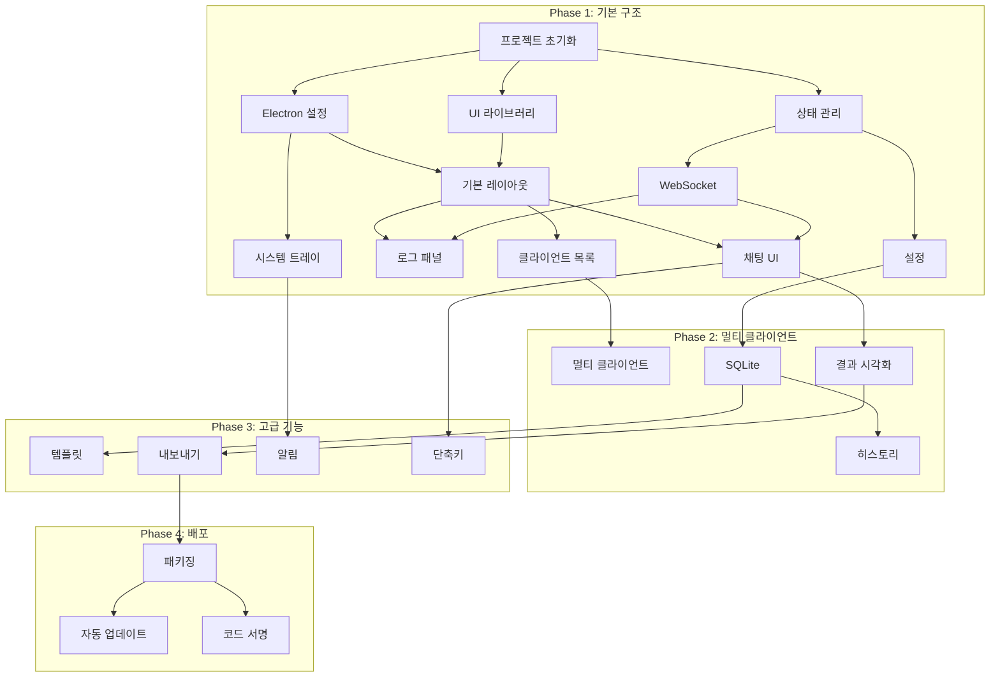

# Chrome Agent UI - 개발 태스크 목록

> **문서 버전:** 1.0
> **생성일:** 2025-01-11
> **기반 문서:** agent-ui-prd.md

---

## 태스크 상태 범례

- ⬜ 미시작 (Not Started)
- 🔄 진행 중 (In Progress)
- ✅ 완료 (Completed)
- ⏸️ 보류 (On Hold)
- ❌ 취소 (Cancelled)

---

## Phase 1: 기본 구조 (v1.0.0)

### 1.1 프로젝트 초기화

| ID | 태스크 | 상태 | 우선순위 | 예상 복잡도 |
|----|--------|------|----------|-------------|
| 1.1.1 | Electron + Vite + React 프로젝트 생성 (electron-vite 템플릿) | ✅ | P0 | Low |
| 1.1.2 | TypeScript 설정 (tsconfig.json, tsconfig.node.json) | ✅ | P0 | Low |
| 1.1.3 | TailwindCSS 4 설정 (@tailwindcss/vite) | ✅ | P0 | Low |
| 1.1.4 | ESLint + Prettier 설정 | ✅ | P1 | Low |
| 1.1.5 | 프로젝트 디렉토리 구조 생성 | ✅ | P0 | Low |
| 1.1.6 | 기본 의존성 설치 (react, zustand, tanstack-query 등) | ✅ | P0 | Low |
| 1.1.7 | 경로 별칭 설정 (@/ → src/) | ✅ | P1 | Low |

**세부 내용:**

```bash
# 1.1.1 프로젝트 생성
npm create electron-vite@latest agent-ui -- --template react-ts

# 1.1.6 기본 의존성
npm install react react-dom zustand @tanstack/react-query clsx tailwind-merge lucide-react date-fns
npm install -D tailwindcss @tailwindcss/vite
```

---

### 1.2 Electron 메인 프로세스 설정

| ID | 태스크 | 상태 | 우선순위 | 예상 복잡도 |
|----|--------|------|----------|-------------|
| 1.2.1 | 메인 프로세스 진입점 (electron/main.ts) 작성 | ✅ | P0 | Medium |
| 1.2.2 | Preload 스크립트 작성 (electron/preload.ts) | ✅ | P0 | Medium |
| 1.2.3 | BrowserWindow 설정 (크기, 보안 옵션) | ✅ | P0 | Low |
| 1.2.4 | 커스텀 타이틀바 설정 (frameless window) | ✅ | P1 | Medium |
| 1.2.5 | 개발/프로덕션 환경 분기 처리 | ✅ | P1 | Low |

**세부 내용 (1.2.1):**

```typescript
// electron/main.ts
- BrowserWindow 생성
- 개발 모드: localhost 로드
- 프로덕션: 빌드된 HTML 로드
- webPreferences 보안 설정 (nodeIntegration: false, contextIsolation: true)
```

---

### 1.3 기본 레이아웃 구현

| ID | 태스크 | 상태 | 우선순위 | 예상 복잡도 |
|----|--------|------|----------|-------------|
| 1.3.1 | AppLayout 컴포넌트 작성 | ✅ | P0 | Medium |
| 1.3.2 | TitleBar 컴포넌트 (윈도우 컨트롤) | ✅ | P0 | Medium |
| 1.3.3 | Sidebar 컴포넌트 (왼쪽 클라이언트 목록) | ✅ | P0 | Medium |
| 1.3.4 | MainContent 컴포넌트 (중앙 영역) | ✅ | P0 | Low |
| 1.3.5 | LogPanel 컴포넌트 (오른쪽 로그 패널) | ✅ | P0 | Medium |
| 1.3.6 | StatusBar 컴포넌트 (하단 상태바) | ✅ | P0 | Low |
| 1.3.7 | 리사이즈 핸들 구현 (Sidebar, LogPanel) | ✅ | P1 | Medium |

**세부 내용 (1.3.1):**

```
┌─────────────────────────────────────────────────┐
│ TitleBar                                        │
├──────────┬─────────────────────┬────────────────┤
│ Sidebar  │    MainContent      │   LogPanel     │
│ (200px)  │     (flex-1)        │   (350px)      │
├──────────┴─────────────────────┴────────────────┤
│ StatusBar                                       │
└─────────────────────────────────────────────────┘
```

---

### 1.4 UI 컴포넌트 라이브러리 설정

| ID | 태스크 | 상태 | 우선순위 | 예상 복잡도 |
|----|--------|------|----------|-------------|
| 1.4.1 | shadcn/ui 초기화 (components.json) | ✅ | P0 | Low |
| 1.4.2 | Button 컴포넌트 추가 | ✅ | P0 | Low |
| 1.4.3 | Input 컴포넌트 추가 | ✅ | P0 | Low |
| 1.4.4 | Select 컴포넌트 추가 | ✅ | P0 | Low |
| 1.4.5 | Dialog 컴포넌트 추가 | ✅ | P0 | Low |
| 1.4.6 | Toast 컴포넌트 추가 | ✅ | P0 | Low |
| 1.4.7 | ScrollArea 컴포넌트 추가 | ✅ | P0 | Low |
| 1.4.8 | Badge 컴포넌트 추가 | ✅ | P1 | Low |
| 1.4.9 | DropdownMenu 컴포넌트 추가 | ✅ | P1 | Low |
| 1.4.10 | Tooltip 컴포넌트 추가 | ✅ | P1 | Low |

---

### 1.5 상태 관리 설정

| ID | 태스크 | 상태 | 우선순위 | 예상 복잡도 |
|----|--------|------|----------|-------------|
| 1.5.1 | connectionStore 구현 (연결 상태) | ✅ | P0 | Medium |
| 1.5.2 | clientStore 구현 (클라이언트 목록) | ✅ | P0 | Medium |
| 1.5.3 | chatStore 구현 (메시지 관리) | ✅ | P0 | Medium |
| 1.5.4 | logStore 구현 (로그 데이터) | ✅ | P0 | Medium |
| 1.5.5 | settingsStore 구현 (설정) | ✅ | P0 | Medium |
| 1.5.6 | uiStore 구현 (UI 상태) | ✅ | P1 | Low |

**세부 내용 (1.5.1):**

```typescript
// stores/connectionStore.ts
interface ConnectionState {
  status: 'disconnected' | 'connecting' | 'connected' | 'reconnecting' | 'error';
  serverUrl: string;
  sessionId: string | null;
  reconnectAttempts: number;
  lastError: string | null;

  // Actions
  connect: () => Promise<void>;
  disconnect: () => void;
  setStatus: (status: ConnectionStatus) => void;
}
```

---

### 1.6 WebSocket 연결 기능

| ID | 태스크 | 상태 | 우선순위 | 예상 복잡도 |
|----|--------|------|----------|-------------|
| 1.6.1 | WebSocket 서비스 클래스 구현 | ✅ | P0 | High |
| 1.6.2 | useWebSocket 훅 구현 | ✅ | P0 | High |
| 1.6.3 | 연결/해제 로직 구현 | ✅ | P0 | Medium |
| 1.6.4 | 자동 재연결 로직 구현 (지수 백오프) | ✅ | P0 | Medium |
| 1.6.5 | Heartbeat 구현 (10초 간격) | ✅ | P0 | Low |
| 1.6.6 | 메시지 송수신 처리 | ✅ | P0 | Medium |
| 1.6.7 | 메시지 타입별 핸들러 분기 | ✅ | P0 | Medium |
| 1.6.8 | 로그 스토어 연동 (모든 메시지 로깅) | ✅ | P0 | Low |

**세부 내용 (1.6.1):**

```typescript
// services/websocket.ts
class WebSocketService {
  private socket: WebSocket | null = null;
  private reconnectAttempts = 0;
  private maxReconnectAttempts = 5;

  connect(url: string): Promise<void>;
  disconnect(): void;
  send(message: WSMessage): boolean;

  // Event handlers
  onMessage(handler: (msg: WSMessage) => void): void;
  onStatusChange(handler: (status: ConnectionStatus) => void): void;
}
```

---

### 1.7 채팅 UI 구현

| ID | 태스크 | 상태 | 우선순위 | 예상 복잡도 |
|----|--------|------|----------|-------------|
| 1.7.1 | ChatContainer 컴포넌트 | ✅ | P0 | Medium |
| 1.7.2 | ChatHeader 컴포넌트 (클라이언트 정보) | ✅ | P0 | Low |
| 1.7.3 | MessageList 컴포넌트 | ✅ | P0 | Medium |
| 1.7.4 | MessageBubble 컴포넌트 (사용자/AI 메시지) | ✅ | P0 | Medium |
| 1.7.5 | InputArea 컴포넌트 (메시지 입력) | ✅ | P0 | Medium |
| 1.7.6 | TypingIndicator 컴포넌트 | ✅ | P1 | Low |
| 1.7.7 | 자동 스크롤 구현 | ✅ | P0 | Low |
| 1.7.8 | 메시지 전송 기능 연동 | ✅ | P0 | Medium |
| 1.7.9 | 실행 상태 표시 (sending, processing, executing) | ✅ | P0 | Low |

---

### 1.8 로그 패널 구현

| ID | 태스크 | 상태 | 우선순위 | 예상 복잡도 |
|----|--------|------|----------|-------------|
| 1.8.1 | LogPanel 컴포넌트 (컨테이너) | ✅ | P0 | Medium |
| 1.8.2 | LogPanelHeader 컴포넌트 (필터, 컨트롤) | ✅ | P0 | Medium |
| 1.8.3 | LogList 컴포넌트 (가상화 리스트) | ✅ | P0 | High |
| 1.8.4 | LogEntry 컴포넌트 (개별 로그) | ✅ | P0 | Medium |
| 1.8.5 | LogFilter 컴포넌트 (타입, 방향 필터) | ✅ | P0 | Medium |
| 1.8.6 | LogSearch 컴포넌트 (검색) | ✅ | P1 | Low |
| 1.8.7 | LogDetailDialog 컴포넌트 (상세 보기) | ✅ | P1 | Medium |
| 1.8.8 | 자동 스크롤 / 일시정지 토글 | ✅ | P0 | Low |
| 1.8.9 | 클라이언트 선택에 따른 필터링 | ✅ | P0 | Medium |
| 1.8.10 | 전체 에이전트 로그 모드 | ✅ | P0 | Medium |

**세부 내용 (1.8.3):**

```typescript
// 가상화를 위한 라이브러리 선택
// Option 1: @tanstack/react-virtual
// Option 2: react-window

// 예상 로그 엔트리 높이: 60px
// 최대 렌더링 아이템: viewport / 60 + buffer
```

---

### 1.9 클라이언트 목록 (Sidebar)

| ID | 태스크 | 상태 | 우선순위 | 예상 복잡도 |
|----|--------|------|----------|-------------|
| 1.9.1 | ClientList 컴포넌트 | ✅ | P0 | Medium |
| 1.9.2 | ClientItem 컴포넌트 | ✅ | P0 | Medium |
| 1.9.3 | StatusIndicator 컴포넌트 (연결 상태 표시) | ✅ | P0 | Low |
| 1.9.4 | 클라이언트 선택 기능 | ✅ | P0 | Low |
| 1.9.5 | 빈 상태 표시 (클라이언트 없음) | ✅ | P0 | Low |
| 1.9.6 | 클라이언트 STATUS 메시지 처리 | ✅ | P0 | Medium |

---

### 1.10 기본 설정

| ID | 태스크 | 상태 | 우선순위 | 예상 복잡도 |
|----|--------|------|----------|-------------|
| 1.10.1 | electron-store 설정 | ✅ | P0 | Low |
| 1.10.2 | 설정 IPC 핸들러 (get/set) | ✅ | P0 | Medium |
| 1.10.3 | SettingsDialog 컴포넌트 | ✅ | P0 | Medium |
| 1.10.4 | ServerSettings 컴포넌트 (서버 URL) | ✅ | P0 | Low |
| 1.10.5 | UISettings 컴포넌트 (테마) | ✅ | P1 | Medium |
| 1.10.6 | 테마 시스템 구현 (light/dark/system) | ✅ | P1 | Medium |
| 1.10.7 | useSettings 훅 구현 | ✅ | P0 | Low |

---

### 1.11 시스템 트레이

| ID | 태스크 | 상태 | 우선순위 | 예상 복잡도 |
|----|--------|------|----------|-------------|
| 1.11.1 | Tray 서비스 구현 (electron/services/tray.ts) | ✅ | P1 | Medium |
| 1.11.2 | 트레이 아이콘 리소스 생성 | ✅ | P1 | Low |
| 1.11.3 | 트레이 컨텍스트 메뉴 | ✅ | P1 | Low |
| 1.11.4 | 트레이 클릭 시 윈도우 표시/숨김 | ✅ | P1 | Low |
| 1.11.5 | 연결 상태에 따른 아이콘 변경 | ✅ | P2 | Low |

---

### 1.12 공통 컴포넌트

| ID | 태스크 | 상태 | 우선순위 | 예상 복잡도 |
|----|--------|------|----------|-------------|
| 1.12.1 | Spinner 컴포넌트 | ✅ | P0 | Low |
| 1.12.2 | EmptyState 컴포넌트 | ✅ | P0 | Low |
| 1.12.3 | ErrorBoundary 컴포넌트 | ✅ | P1 | Low |
| 1.12.4 | ToastContainer 설정 | ✅ | P0 | Low |

---

## Phase 2: 멀티 클라이언트 & 히스토리 (v1.1.0)

### 2.1 멀티 클라이언트 관리

| ID | 태스크 | 상태 | 우선순위 | 예상 복잡도 |
|----|--------|------|----------|-------------|
| 2.1.1 | 클라이언트별 메시지 분리 저장 | ✅ | P0 | Medium |
| 2.1.2 | 클라이언트 전환 시 채팅 컨텍스트 전환 | ✅ | P0 | Medium |
| 2.1.3 | 클라이언트 별명 지정 기능 | ✅ | P1 | Low |
| 2.1.4 | 클라이언트별 로그 필터링 개선 | ✅ | P0 | Medium |
| 2.1.5 | 클라이언트 메타데이터 표시 (URL, 브라우저) | ⬜ | P1 | Low |

---

### 2.2 로컬 데이터 저장 (SQLite)

| ID | 태스크 | 상태 | 우선순위 | 예상 복잡도 |
|----|--------|------|----------|-------------|
| 2.2.1 | better-sqlite3 설정 | ✅ | P0 | Medium |
| 2.2.2 | 데이터베이스 초기화 (스키마 생성) | ✅ | P0 | Medium |
| 2.2.3 | 메시지 저장 IPC 핸들러 | ✅ | P0 | Medium |
| 2.2.4 | 메시지 조회 IPC 핸들러 (페이지네이션) | ✅ | P0 | Medium |
| 2.2.5 | 클라이언트 정보 저장/조회 | ✅ | P1 | Medium |
| 2.2.6 | 로그 저장 (선택적) | ✅ | P2 | Medium |
| 2.2.7 | 데이터 삭제 기능 | ✅ | P1 | Low |

**DB 스키마:**

```sql
-- messages 테이블
CREATE TABLE messages (
    id TEXT PRIMARY KEY,
    client_id TEXT NOT NULL,
    type TEXT NOT NULL,
    content TEXT NOT NULL,
    data TEXT,
    status TEXT,
    created_at DATETIME DEFAULT CURRENT_TIMESTAMP
);

-- clients 테이블
CREATE TABLE clients (
    id TEXT PRIMARY KEY,
    name TEXT,
    last_session_id TEXT,
    last_active DATETIME,
    metadata TEXT,
    created_at DATETIME DEFAULT CURRENT_TIMESTAMP
);
```

---

### 2.3 결과 데이터 시각화 개선

| ID | 태스크 | 상태 | 우선순위 | 예상 복잡도 |
|----|--------|------|----------|-------------|
| 2.3.1 | ResultViewer 컴포넌트 | ✅ | P0 | High |
| 2.3.2 | JSON 트리 뷰어 구현 | ✅ | P0 | Medium |
| 2.3.3 | 테이블 형식 표시 (쿠키, DOM 결과) | ✅ | P1 | Medium |
| 2.3.4 | 축소/확장 토글 | ✅ | P1 | Low |
| 2.3.5 | 결과 복사 기능 | ✅ | P0 | Low |

---

### 2.4 히스토리 기능

| ID | 태스크 | 상태 | 우선순위 | 예상 복잡도 |
|----|--------|------|----------|-------------|
| 2.4.1 | 이전 대화 불러오기 | ✅ | P0 | Medium |
| 2.4.2 | 무한 스크롤 (위로 스크롤 시 이전 메시지) | ✅ | P1 | Medium |
| 2.4.3 | 대화 초기화 기능 | ✅ | P1 | Low |

---

## Phase 3: 고급 기능 (v1.2.0)

### 3.1 명령 템플릿

| ID | 태스크 | 상태 | 우선순위 | 예상 복잡도 |
|----|--------|------|----------|-------------|
| 3.1.1 | templates 테이블 추가 | ✅ | P2 | Low |
| 3.1.2 | 템플릿 저장 기능 | ✅ | P2 | Medium |
| 3.1.3 | 템플릿 목록 UI | ✅ | P2 | Medium |
| 3.1.4 | 템플릿 적용 기능 | ✅ | P2 | Low |
| 3.1.5 | 템플릿 관리 (수정, 삭제) | ✅ | P2 | Medium |

---

### 3.2 내보내기 기능

| ID | 태스크 | 상태 | 우선순위 | 예상 복잡도 |
|----|--------|------|----------|-------------|
| 3.2.1 | 결과 JSON 내보내기 | ✅ | P1 | Low |
| 3.2.2 | 결과 CSV 내보내기 | ✅ | P2 | Medium |
| 3.2.3 | 로그 JSON 내보내기 | ✅ | P1 | Low |
| 3.2.4 | 로그 CSV 내보내기 | ✅ | P2 | Medium |
| 3.2.5 | 파일 저장 다이얼로그 (IPC) | ✅ | P1 | Low |

---

### 3.3 알림 기능

| ID | 태스크 | 상태 | 우선순위 | 예상 복잡도 |
|----|--------|------|----------|-------------|
| 3.3.1 | Notification 서비스 구현 | ✅ | P1 | Medium |
| 3.3.2 | 연결 상태 변경 알림 | ✅ | P1 | Low |
| 3.3.3 | 명령 완료 알림 | ✅ | P1 | Low |
| 3.3.4 | 알림 설정 UI (NotificationSettings) | ✅ | P1 | Medium |
| 3.3.5 | 사운드 알림 (선택적) | ✅ | P2 | Low |

---

### 3.4 단축키

| ID | 태스크 | 상태 | 우선순위 | 예상 복잡도 |
|----|--------|------|----------|-------------|
| 3.4.1 | useShortcuts 훅 구현 | ✅ | P1 | Medium |
| 3.4.2 | 메시지 전송 단축키 (Ctrl+Enter) | ✅ | P1 | Low |
| 3.4.3 | 설정 열기 단축키 (Ctrl+,) | ✅ | P2 | Low |
| 3.4.4 | 로그 패널 토글 단축키 | ✅ | P2 | Low |
| 3.4.5 | ShortcutSettings 컴포넌트 | ✅ | P2 | Medium |
| 3.4.6 | 글로벌 단축키 (앱 백그라운드) | ✅ | P2 | Medium |

---

## Phase 4: 배포 준비 (v2.0.0)

### 4.1 빌드 및 패키징

| ID | 태스크 | 상태 | 우선순위 | 예상 복잡도 |
|----|--------|------|----------|-------------|
| 4.1.1 | electron-builder 설정 | ✅ | P0 | Medium |
| 4.1.2 | Windows NSIS 인스톨러 설정 | ✅ | P0 | Medium |
| 4.1.3 | Windows Portable 빌드 | ✅ | P1 | Low |
| 4.1.4 | macOS DMG 빌드 | ✅ | P1 | Medium |
| 4.1.5 | Linux AppImage 빌드 | ✅ | P2 | Medium |
| 4.1.6 | 앱 아이콘 리소스 생성 | ⬜ | P0 | Low |
| 4.1.7 | 빌드 스크립트 최적화 | ✅ | P1 | Low |

---

### 4.2 자동 업데이트

| ID | 태스크 | 상태 | 우선순위 | 예상 복잡도 |
|----|--------|------|----------|-------------|
| 4.2.1 | electron-updater 설정 | ✅ | P2 | High |
| 4.2.2 | 업데이트 서버 설정 (GitHub Releases) | ✅ | P2 | Medium |
| 4.2.3 | 업데이트 UI (알림, 진행 상태) | ✅ | P2 | Medium |
| 4.2.4 | 자동 업데이트 설정 옵션 | ✅ | P2 | Low |

---

### 4.3 코드 서명

| ID | 태스크 | 상태 | 우선순위 | 예상 복잡도 |
|----|--------|------|----------|-------------|
| 4.3.1 | Windows 코드 서명 설정 | ⬜ | P2 | High |
| 4.3.2 | macOS 코드 서명 및 공증 | ⬜ | P2 | High |

---

### 4.4 다국어 지원

| ID | 태스크 | 상태 | 우선순위 | 예상 복잡도 |
|----|--------|------|----------|-------------|
| 4.4.1 | i18n 라이브러리 설정 (react-i18next) | ✅ | P3 | Medium |
| 4.4.2 | 한국어 번역 파일 | ✅ | P3 | Medium |
| 4.4.3 | 영어 번역 파일 | ✅ | P3 | Medium |
| 4.4.4 | 언어 설정 UI | ✅ | P3 | Low |

---

## 테스트 태스크

### T.1 단위 테스트

| ID | 태스크 | 상태 | 우선순위 | 예상 복잡도 |
|----|--------|------|----------|-------------|
| T.1.1 | Vitest 설정 | ⬜ | P1 | Low |
| T.1.2 | Store 테스트 (connectionStore, clientStore) | ⬜ | P1 | Medium |
| T.1.3 | 유틸리티 함수 테스트 | ⬜ | P1 | Low |
| T.1.4 | 커스텀 훅 테스트 | ⬜ | P2 | Medium |

---

### T.2 컴포넌트 테스트

| ID | 태스크 | 상태 | 우선순위 | 예상 복잡도 |
|----|--------|------|----------|-------------|
| T.2.1 | Testing Library 설정 | ⬜ | P2 | Low |
| T.2.2 | MessageBubble 테스트 | ⬜ | P2 | Low |
| T.2.3 | LogEntry 테스트 | ⬜ | P2 | Low |
| T.2.4 | ClientItem 테스트 | ⬜ | P2 | Low |

---

### T.3 E2E 테스트

| ID | 태스크 | 상태 | 우선순위 | 예상 복잡도 |
|----|--------|------|----------|-------------|
| T.3.1 | Playwright 설정 | ⬜ | P2 | Medium |
| T.3.2 | 연결 플로우 테스트 | ⬜ | P2 | Medium |
| T.3.3 | 메시지 전송 테스트 | ⬜ | P2 | Medium |
| T.3.4 | 설정 변경 테스트 | ⬜ | P3 | Medium |

---

## 태스크 의존성 그래프



---

## 우선순위 기준

| 우선순위 | 설명 |
|----------|------|
| **P0** | 핵심 기능, MVP에 필수 |
| **P1** | 중요 기능, v1.0에 포함 권장 |
| **P2** | 편의 기능, v1.1 이후 |
| **P3** | 부가 기능, 시간 여유 시 |

---

## 복잡도 기준

| 복잡도 | 예상 작업 시간 |
|--------|---------------|
| **Low** | 1-2시간 |
| **Medium** | 반나절 (3-4시간) |
| **High** | 하루 이상 |

---

## 변경 이력

| 버전 | 날짜 | 변경 내용 |
|------|------|-----------|
| 1.0 | 2025-01-11 | 초안 작성 |
| 1.1 | 2025-01-11 | Phase 1 주요 태스크 완료 (프로젝트 구조, 레이아웃, 상태관리, WebSocket, 채팅 UI, 로그 패널, 설정) |
| 1.2 | 2025-01-11 | Phase 1 완료 (Toast, Tooltip, ErrorBoundary, LogDetailDialog, 리사이즈 핸들, 테마 시스템, 트레이 아이콘) |
| 1.3 | 2025-01-11 | Phase 2 완료 (SQLite 데이터베이스, 멀티 클라이언트, ResultViewer JSON 트리/테이블 뷰, 히스토리) |
| 1.4 | 2025-01-11 | Phase 3 완료 (명령 템플릿, 내보내기 JSON/CSV, 알림 시스템, 단축키 훅 및 설정) |
| 1.5 | 2025-01-11 | Phase 4 완료 (electron-builder 패키징, electron-updater 자동 업데이트, react-i18next 다국어 지원) |
