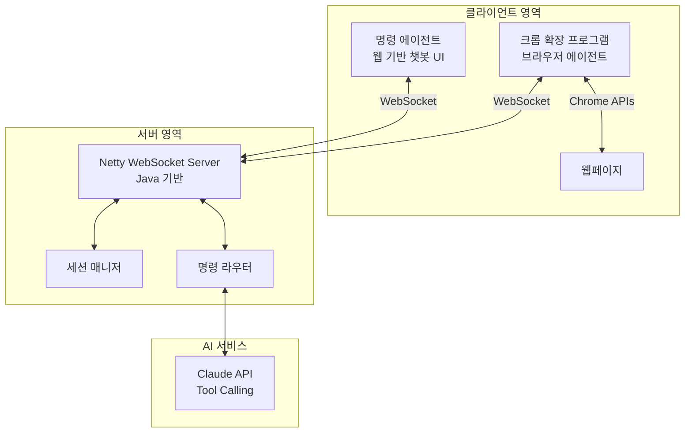
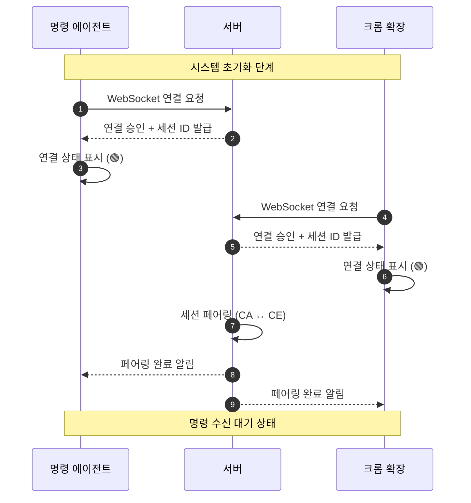
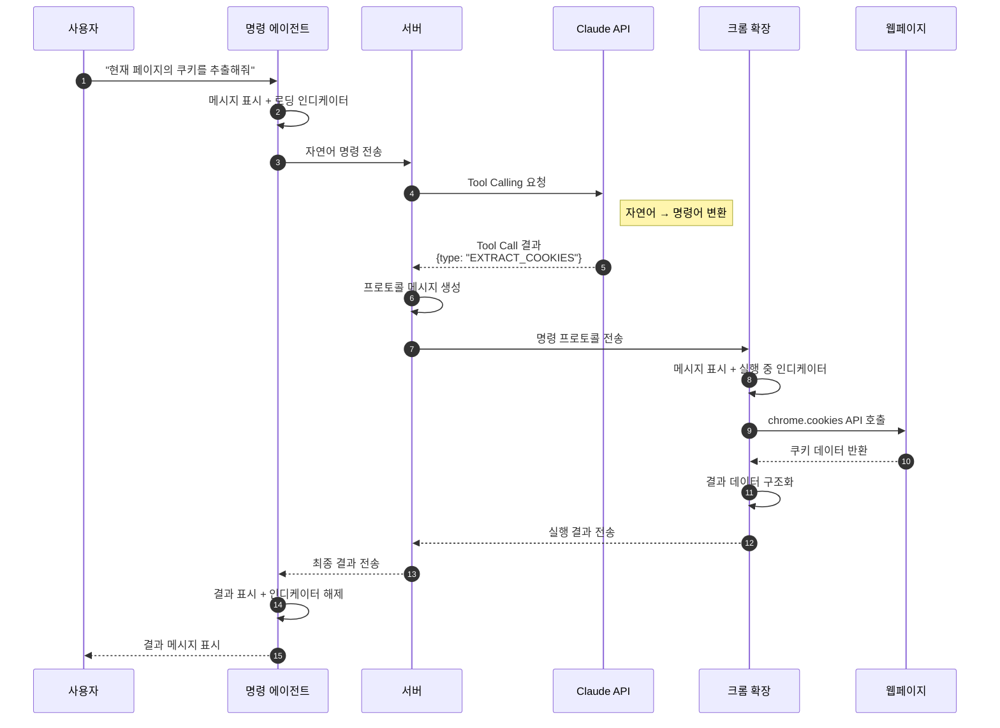
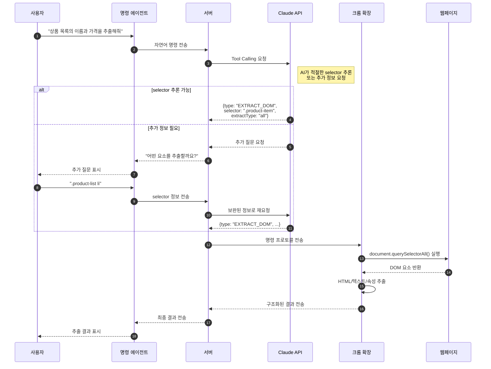
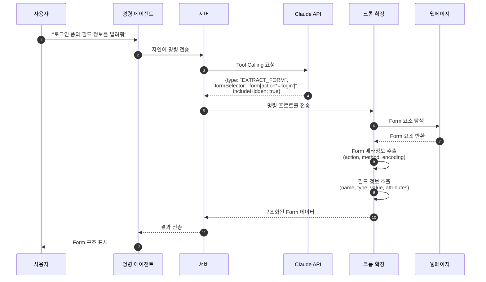
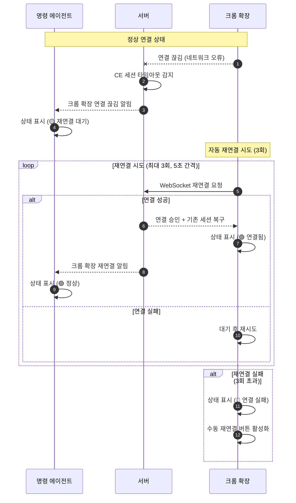
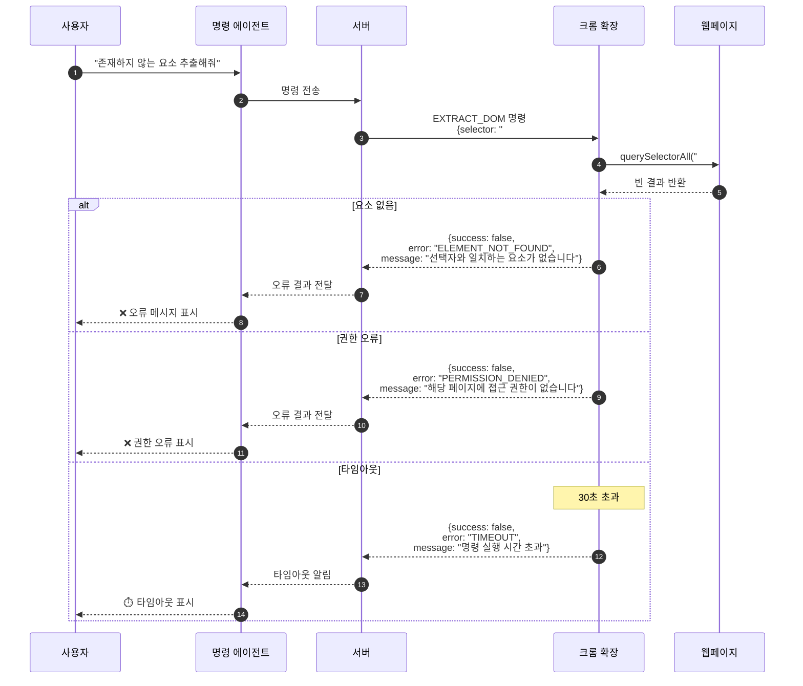
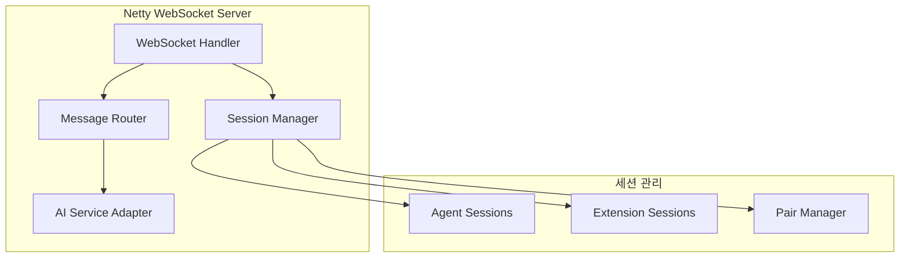

# Chrome Agent PRD (Product Requirements Document)

> **문서 버전:** 1.0  
> **작성일:** 2025-01-10  
> **상태:** Draft - 기능 명세 진행 중

---

## 1. 개요

### 1.1 프로젝트 배경 및 목적

자연어 명령을 통해 웹 브라우저를 원격 제어하고, 웹페이지의 데이터를 추출하는 **AI 기반 브라우저 자동화 시스템**을 개발합니다.

### 1.2 핵심 가치 제안

- 자연어로 브라우저 제어 명령 입력
- AI(Tool Calling)를 통한 명령어 자동 변환
- 실시간 WebSocket 통신으로 즉각적인 피드백
- 웹페이지 데이터 추출 자동화

### 1.3 시스템 관계 정의

| 항목 | 설명 |
|------|------|
| 명령 에이전트 : 크롬 확장 | **1:1 관계** |
| 통신 방식 | WebSocket (동기 방식, 결과 대기) |
| 인증/보안 | Phase 2에서 구현 예정 |

---

## 2. 시스템 아키텍처

### 2.1 전체 구성도



### 2.2 기술 스택

| 컴포넌트 | 기술 |
|----------|------|
| 크롬 확장 프로그램 | Manifest V3, JavaScript/TypeScript, Chrome APIs |
| 서버 프로그램 | Java 17+, Netty, WebSocket |
| 명령 에이전트 | HTML/CSS/JavaScript, WebSocket Client |
| AI 연동 | Claude API (Tool Calling) |

---

## 3. 동작 시나리오

### 3.1 시나리오 1: 시스템 초기 연결

사용자가 시스템을 시작하고 모든 컴포넌트가 연결되는 과정입니다.



**상태 전이:**

| 단계 | 명령 에이전트 상태 | 크롬 확장 상태 | 서버 상태 |
|------|-------------------|----------------|-----------|
| 1 | 🟡 연결 중 | - | 대기 |
| 2 | 🟢 연결됨 | - | CA 세션 생성 |
| 3 | 🟢 연결됨 | 🟡 연결 중 | CA 세션 유지 |
| 4 | 🟢 연결됨 | 🟢 연결됨 | CE 세션 생성 |
| 5 | 🟢 페어링 완료 | 🟢 페어링 완료 | 세션 페어링 완료 |

---

### 3.2 시나리오 2: 자연어 명령 처리 (쿠키 추출)

사용자가 "현재 페이지의 쿠키를 추출해줘"라고 입력했을 때의 처리 흐름입니다.



**처리 단계별 상세:**

| 단계 | 컴포넌트 | 동작 | UI 상태 |
|------|----------|------|---------|
| 1-2 | 명령 에이전트 | 사용자 입력 수신 | 메시지 버블 표시 |
| 3 | 명령 에이전트 | 서버로 전송 | ⏳ 로딩 인디케이터 |
| 4-5 | 서버 | AI API 호출 | - |
| 6-7 | 서버 → 크롬 확장 | 명령 전달 | - |
| 8 | 크롬 확장 | 명령 수신 | ⏳ 실행 중 표시 |
| 9-10 | 크롬 확장 | 쿠키 추출 실행 | ⏳ 실행 중 |
| 11-12 | 크롬 확장 → 서버 | 결과 전송 | ✅ 완료 |
| 13-14 | 서버 → 명령 에이전트 | 결과 전달 | ✅ 결과 표시 |

---

### 3.3 시나리오 3: DOM 요소 추출

사용자가 "상품 목록의 이름과 가격을 추출해줘"라고 입력했을 때의 처리 흐름입니다.



---

### 3.4 시나리오 4: Form 정보 추출

로그인 폼의 필드 정보를 추출하는 시나리오입니다.



---

### 3.5 시나리오 5: 연결 끊김 및 재연결

네트워크 문제로 연결이 끊어졌을 때의 복구 시나리오입니다.



**재연결 정책:**

| 항목 | 값 |
|------|-----|
| 최대 재시도 횟수 | 3회 |
| 재시도 간격 | 5초 |
| 세션 유지 시간 | 30초 |
| Heartbeat 간격 | 10초 |

---

### 3.6 시나리오 6: 명령 실행 오류 처리

명령 실행 중 오류가 발생했을 때의 처리 흐름입니다.



---

## 4. 컴포넌트별 기능 명세

### 4.1 크롬 확장 프로그램

#### 4.1.1 디렉토리 구조

```
chrome-agent-extension/
├── manifest.json
├── background/
│   └── service-worker.js      # WebSocket 연결 관리
├── content/
│   └── content-script.js      # DOM/Cookie/Form 추출 실행
├── popup/
│   ├── popup.html             # 챗봇 UI
│   ├── popup.css
│   └── popup.js
├── components/
│   ├── chat-ui.js             # 챗봇 메시지 렌더링
│   └── status-indicator.js    # 상태 인디케이터
└── utils/
    ├── extractor.js           # 데이터 추출 유틸리티
    └── protocol.js            # 프로토콜 파싱/생성
```

#### 4.1.2 UI 레이아웃

```
┌─────────────────────────────────────┐
│  🔌 Chrome Agent          [●] 연결됨 │  ← 헤더: 연결 상태
├─────────────────────────────────────┤
│                                     │
│  ┌─────────────────────────────┐   │
│  │ 🤖 서버                      │   │  ← 서버 메시지
│  │ 쿠키 정보를 추출합니다...     │   │
│  └─────────────────────────────┘   │
│                                     │
│  ┌─────────────────────────────┐   │
│  │ ⚙️ 실행 중...               │   │  ← 로딩 인디케이터
│  │ ◐ (회전 애니메이션)          │   │
│  └─────────────────────────────┘   │
│                                     │
│  ┌─────────────────────────────┐   │
│  │ ✅ 완료                      │   │  ← 결과 메시지
│  │ 3개의 쿠키를 추출했습니다.    │   │
│  └─────────────────────────────┘   │
│                                     │  ← 메시지 영역
├─────────────────────────────────────┤
│  서버: ws://localhost:8080          │  ← 설정 영역
│  [연결] [연결 해제]                  │
└─────────────────────────────────────┘
```

#### 4.1.3 상태 인디케이터

| 상태 코드 | 아이콘 | 텍스트 | 설명 |
|-----------|--------|--------|------|
| `disconnected` | 🔴 | 연결 안됨 | WebSocket 미연결 |
| `connecting` | 🟡 | 연결 중... | 연결 시도 중 (애니메이션) |
| `connected` | 🟢 | 연결됨 | 정상 연결 |
| `executing` | ⏳ | 실행 중... | 명령 실행 중 (스피너) |
| `success` | ✅ | 완료 | 명령 성공 |
| `error` | ❌ | 오류 | 명령 실패 |

---

### 4.2 명령어 타입 정의

#### 4.2.1 명령어 목록

| 명령어 타입 | 코드 | 설명 | Phase |
|-------------|------|------|-------|
| 쿠키 추출 | `EXTRACT_COOKIES` | 현재 탭의 쿠키 추출 | 1 |
| DOM 추출 | `EXTRACT_DOM` | 특정 selector의 HTML/속성 추출 | 1 |
| Form 추출 | `EXTRACT_FORM` | Form 및 필드 정보 추출 | 1 |
| 페이지 정보 | `GET_PAGE_INFO` | URL, Title 등 기본 정보 | 1 |
| 스크린샷 | `CAPTURE_SCREENSHOT` | 현재 화면 캡처 | 2 |
| 클릭 | `CLICK_ELEMENT` | 특정 요소 클릭 | 2 |
| 입력 | `INPUT_TEXT` | 텍스트 입력 | 2 |

---

#### 4.2.2 EXTRACT_COOKIES - 쿠키 추출

**요청 파라미터:**

| 파라미터 | 타입 | 필수 | 기본값 | 설명 |
|----------|------|------|--------|------|
| `domain` | string | N | 현재 도메인 | 특정 도메인 쿠키만 추출 |
| `names` | string[] | N | 전체 | 특정 이름의 쿠키만 추출 |

**요청 예시:**
```json
{
  "command": "EXTRACT_COOKIES",
  "params": {
    "domain": ".example.com",
    "names": ["session_id", "auth_token"]
  }
}
```

**응답 데이터:**
```json
{
  "success": true,
  "data": {
    "cookies": [
      {
        "name": "session_id",
        "value": "abc123...",
        "domain": ".example.com",
        "path": "/",
        "secure": true,
        "httpOnly": true,
        "sameSite": "lax",
        "expirationDate": 1735689600
      }
    ],
    "count": 1
  }
}
```

---

#### 4.2.3 EXTRACT_DOM - DOM 추출

**요청 파라미터:**

| 파라미터 | 타입 | 필수 | 기본값 | 설명 |
|----------|------|------|--------|------|
| `selector` | string | Y | - | CSS 선택자 |
| `extractType` | enum | Y | - | `html`, `text`, `attribute`, `all` |
| `attributes` | string[] | N | [] | 추출할 속성명 |
| `multiple` | boolean | N | false | 여러 요소 추출 여부 |

**요청 예시:**
```json
{
  "command": "EXTRACT_DOM",
  "params": {
    "selector": ".product-item",
    "extractType": "all",
    "attributes": ["data-id", "data-price"],
    "multiple": true
  }
}
```

**응답 데이터:**
```json
{
  "success": true,
  "data": {
    "elements": [
      {
        "index": 0,
        "html": "<div class='product-item'>...</div>",
        "text": "상품명 A",
        "attributes": {
          "class": "product-item",
          "data-id": "12345",
          "data-price": "29000"
        },
        "tagName": "DIV",
        "rect": {
          "x": 100,
          "y": 200,
          "width": 300,
          "height": 150
        }
      }
    ],
    "count": 1,
    "selector": ".product-item"
  }
}
```

---

#### 4.2.4 EXTRACT_FORM - Form 추출

**요청 파라미터:**

| 파라미터 | 타입 | 필수 | 기본값 | 설명 |
|----------|------|------|--------|------|
| `formSelector` | string | Y | - | Form 요소의 CSS 선택자 |
| `includeHidden` | boolean | N | true | hidden 필드 포함 여부 |

**요청 예시:**
```json
{
  "command": "EXTRACT_FORM",
  "params": {
    "formSelector": "#login-form",
    "includeHidden": true
  }
}
```

**응답 데이터:**
```json
{
  "success": true,
  "data": {
    "form": {
      "action": "/api/login",
      "method": "POST",
      "encoding": "application/x-www-form-urlencoded",
      "name": "loginForm",
      "id": "login-form"
    },
    "fields": [
      {
        "name": "username",
        "type": "text",
        "value": "",
        "id": "user-input",
        "required": true,
        "placeholder": "아이디 입력",
        "maxLength": 50
      },
      {
        "name": "password",
        "type": "password",
        "value": "",
        "id": "pass-input",
        "required": true
      },
      {
        "name": "_csrf",
        "type": "hidden",
        "value": "token_abc123"
      }
    ],
    "fieldCount": 3
  }
}
```

---

#### 4.2.5 GET_PAGE_INFO - 페이지 정보

**요청 파라미터:** 없음

**응답 데이터:**
```json
{
  "success": true,
  "data": {
    "url": "https://example.com/products?page=1",
    "title": "상품 목록 - Example Store",
    "domain": "example.com",
    "protocol": "https:",
    "pathname": "/products",
    "search": "?page=1",
    "hash": "",
    "readyState": "complete",
    "contentType": "text/html",
    "characterSet": "UTF-8"
  }
}
```

---

## 5. 프로토콜 명세

### 5.1 메시지 기본 구조

모든 WebSocket 메시지는 JSON 형식으로 전송됩니다.

#### 5.1.1 요청 메시지 (서버 → 클라이언트)

```json
{
  "messageId": "uuid-v4",
  "timestamp": "2025-01-10T12:00:00.000Z",
  "type": "COMMAND",
  "source": "server",
  "target": "extension",
  "payload": {
    "command": "EXTRACT_COOKIES",
    "params": {},
    "displayText": "쿠키 정보를 추출합니다..."
  }
}
```

#### 5.1.2 응답 메시지 (클라이언트 → 서버)

```json
{
  "messageId": "uuid-v4",
  "requestId": "original-request-uuid",
  "timestamp": "2025-01-10T12:00:01.000Z",
  "type": "RESPONSE",
  "source": "extension",
  "target": "server",
  "payload": {
    "success": true,
    "data": {},
    "error": null,
    "executionTime": 150
  }
}
```

### 5.2 메시지 타입 정의

| type | 방향 | 설명 |
|------|------|------|
| `CONNECT` | Client → Server | 연결 요청 |
| `CONNECT_ACK` | Server → Client | 연결 승인 |
| `COMMAND` | Server → Extension | 명령 전달 |
| `RESPONSE` | Extension → Server | 명령 결과 |
| `CHAT` | Agent ↔ Server | 채팅 메시지 |
| `STATUS` | Any → Any | 상태 변경 알림 |
| `HEARTBEAT` | Both | 연결 유지 확인 |
| `ERROR` | Any → Any | 오류 알림 |

### 5.3 에러 코드 정의

| 에러 코드 | 설명 |
|-----------|------|
| `ELEMENT_NOT_FOUND` | 선택자와 일치하는 요소 없음 |
| `PERMISSION_DENIED` | 페이지 접근 권한 없음 |
| `TIMEOUT` | 명령 실행 시간 초과 (30초) |
| `INVALID_SELECTOR` | 잘못된 CSS 선택자 |
| `INVALID_COMMAND` | 알 수 없는 명령어 |
| `CONNECTION_LOST` | WebSocket 연결 끊김 |
| `SESSION_EXPIRED` | 세션 만료 |
| `INTERNAL_ERROR` | 내부 오류 |

---

## 6. 서버 프로그램 명세

### 6.1 아키텍처



### 6.2 주요 모듈

| 모듈 | 책임 |
|------|------|
| `WebSocketHandler` | WebSocket 연결 관리, 메시지 수신/발신 |
| `SessionManager` | 세션 생성/삭제, 페어링 관리 |
| `MessageRouter` | 메시지 타입별 핸들러 라우팅 |
| `AIServiceAdapter` | Claude API 연동, Tool Calling 처리 |
| `ProtocolCodec` | JSON 직렬화/역직렬화 |

### 6.3 Tool Calling 정의

AI API에 전달할 Tool 정의입니다.

```json
{
  "tools": [
    {
      "name": "extract_cookies",
      "description": "웹페이지의 쿠키를 추출합니다",
      "input_schema": {
        "type": "object",
        "properties": {
          "domain": {
            "type": "string",
            "description": "추출할 쿠키의 도메인"
          },
          "names": {
            "type": "array",
            "items": {"type": "string"},
            "description": "추출할 쿠키 이름 목록"
          }
        }
      }
    },
    {
      "name": "extract_dom",
      "description": "웹페이지에서 특정 DOM 요소를 추출합니다",
      "input_schema": {
        "type": "object",
        "properties": {
          "selector": {
            "type": "string",
            "description": "CSS 선택자"
          },
          "extractType": {
            "type": "string",
            "enum": ["html", "text", "attribute", "all"],
            "description": "추출 타입"
          },
          "attributes": {
            "type": "array",
            "items": {"type": "string"},
            "description": "추출할 속성명"
          },
          "multiple": {
            "type": "boolean",
            "description": "여러 요소 추출 여부"
          }
        },
        "required": ["selector", "extractType"]
      }
    },
    {
      "name": "extract_form",
      "description": "웹페이지의 Form 정보를 추출합니다",
      "input_schema": {
        "type": "object",
        "properties": {
          "formSelector": {
            "type": "string",
            "description": "Form 요소의 CSS 선택자"
          },
          "includeHidden": {
            "type": "boolean",
            "description": "hidden 필드 포함 여부"
          }
        },
        "required": ["formSelector"]
      }
    },
    {
      "name": "get_page_info",
      "description": "현재 페이지의 기본 정보를 가져옵니다",
      "input_schema": {
        "type": "object",
        "properties": {}
      }
    }
  ]
}
```

---

## 7. 명령 에이전트 명세

### 7.1 UI 레이아웃

```
┌─────────────────────────────────────────────────────────┐
│  🤖 Chrome Agent Commander              [●] 연결됨      │
├─────────────────────────────────────────────────────────┤
│                                                         │
│  ┌─────────────────────────────────────────────────┐   │
│  │ 👤 사용자                                        │   │
│  │ 현재 페이지의 로그인 폼 정보를 알려줘              │   │
│  └─────────────────────────────────────────────────┘   │
│                                                         │
│  ┌─────────────────────────────────────────────────┐   │
│  │ 🤖 AI                                           │   │
│  │ 로그인 폼 정보를 추출하겠습니다.                   │   │
│  │                                                  │   │
│  │ ⏳ 크롬 확장에서 실행 중...                       │   │
│  └─────────────────────────────────────────────────┘   │
│                                                         │
│  ┌─────────────────────────────────────────────────┐   │
│  │ 🤖 AI                                           │   │
│  │ ✅ Form 정보를 추출했습니다.                      │   │
│  │                                                  │   │
│  │ • action: /api/login                            │   │
│  │ • method: POST                                  │   │
│  │ • 필드 수: 3개                                   │   │
│  │   - username (text, 필수)                       │   │
│  │   - password (password, 필수)                   │   │
│  │   - _csrf (hidden)                              │   │
│  └─────────────────────────────────────────────────┘   │
│                                                         │
├─────────────────────────────────────────────────────────┤
│  ┌─────────────────────────────────────────┐  [전송]   │
│  │ 메시지를 입력하세요...                    │          │
│  └─────────────────────────────────────────┘          │
└─────────────────────────────────────────────────────────┘
```

### 7.2 기능 목록

| 기능 | 설명 |
|------|------|
| 자연어 명령 입력 | 텍스트 입력으로 브라우저 제어 명령 |
| 실시간 상태 표시 | 명령 처리 진행 상황 표시 |
| 결과 시각화 | 추출된 데이터 포맷팅 표시 |
| 연결 상태 관리 | 서버 연결 상태 모니터링 |
| 히스토리 | 이전 명령/결과 조회 (Phase 2) |

---

## 8. 비기능 요구사항

### 8.1 성능

| 항목 | 요구사항 |
|------|----------|
| 명령 응답 시간 | 5초 이내 (단순 추출) |
| 동시 연결 수 | 100+ (서버) |
| 메시지 처리량 | 1000 msg/sec (서버) |
| 타임아웃 | 30초 |

### 8.2 안정성

| 항목 | 요구사항 |
|------|----------|
| 자동 재연결 | 3회 시도, 5초 간격 |
| Heartbeat | 10초 간격 |
| 세션 유지 | 30초 (연결 끊김 후) |

### 8.3 호환성

| 항목 | 요구사항 |
|------|----------|
| Chrome 버전 | 120+ |
| Manifest | V3 |
| Java 버전 | 17+ |

---

## 9. 개발 로드맵

### Phase 1 (MVP)

- [x] 요구사항 정의
- [ ] 크롬 확장 프로그램 기본 구조
- [ ] WebSocket 서버 구현
- [ ] 기본 명령어 구현 (쿠키, DOM, Form, 페이지 정보)
- [ ] 명령 에이전트 UI
- [ ] AI Tool Calling 연동

### Phase 2

- [ ] 인증/보안 구현
- [ ] 스크린샷 캡처
- [ ] 요소 클릭/입력 명령
- [ ] 명령 히스토리
- [ ] 다중 탭 지원

### Phase 3

- [ ] 매크로 기능 (명령 시퀀스 저장/실행)
- [ ] 스케줄링
- [ ] 대시보드

---

## 변경 이력

| 버전 | 날짜 | 변경 내용 |
|------|------|-----------|
| 1.0 | 2025-01-10 | 초안 작성 |
