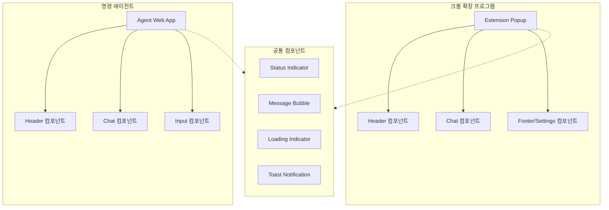
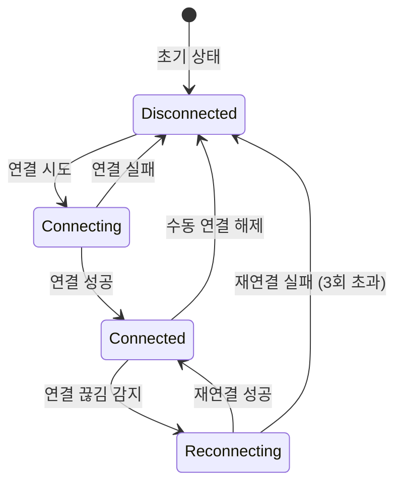
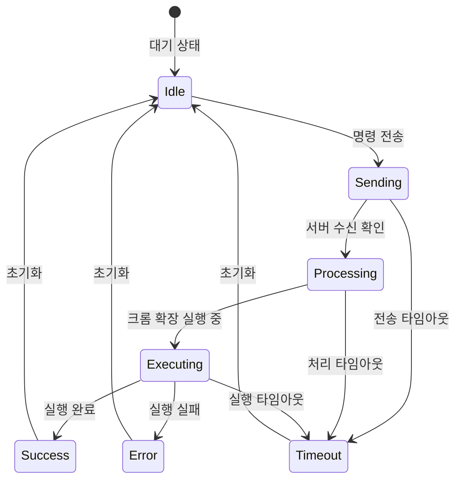
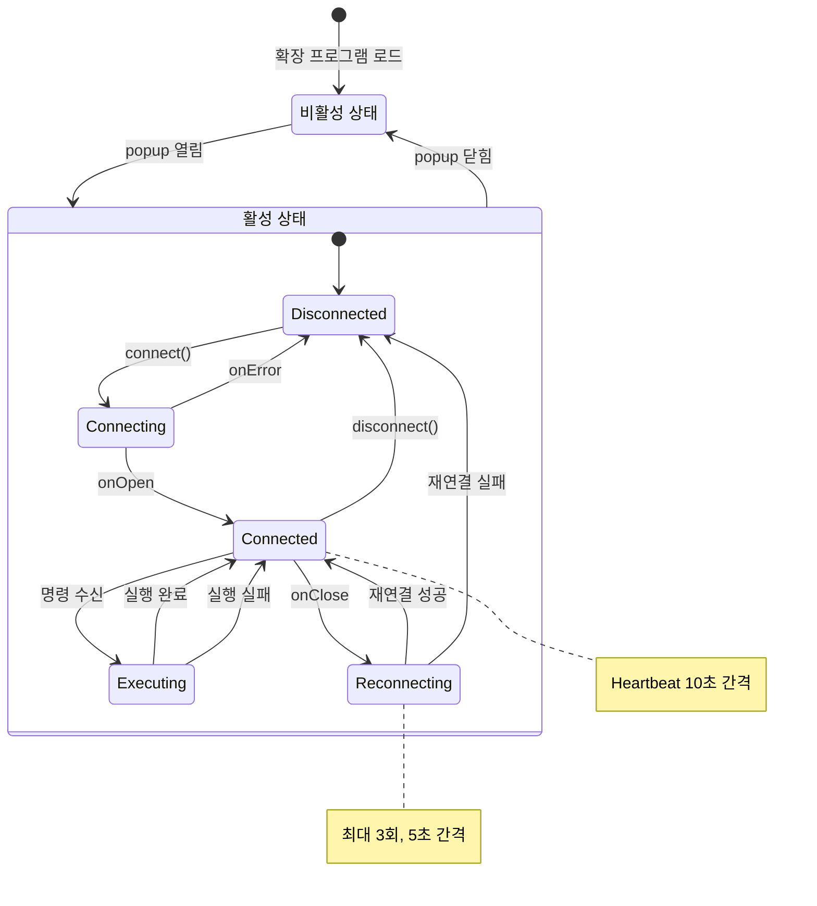
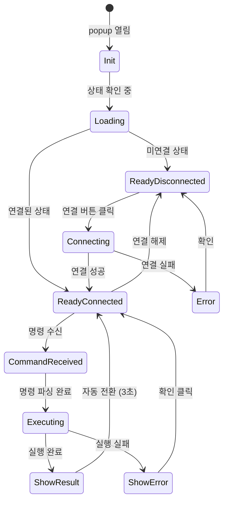
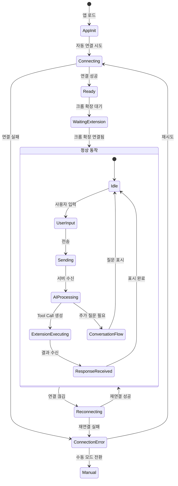
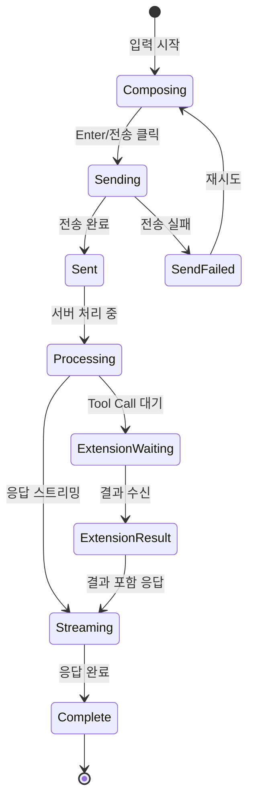
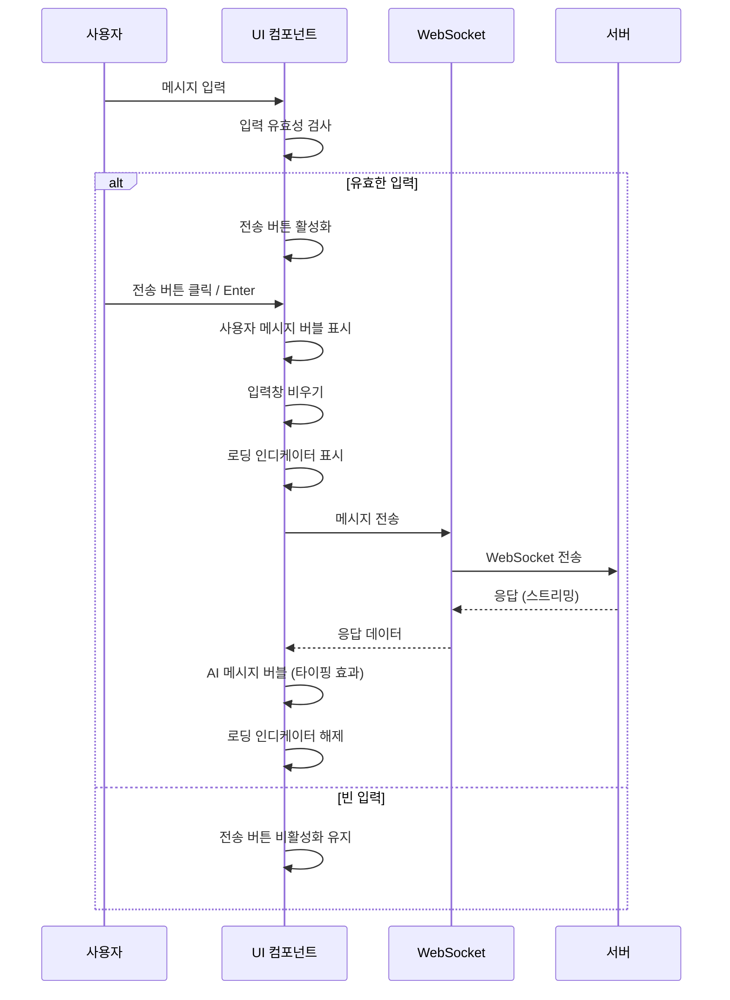
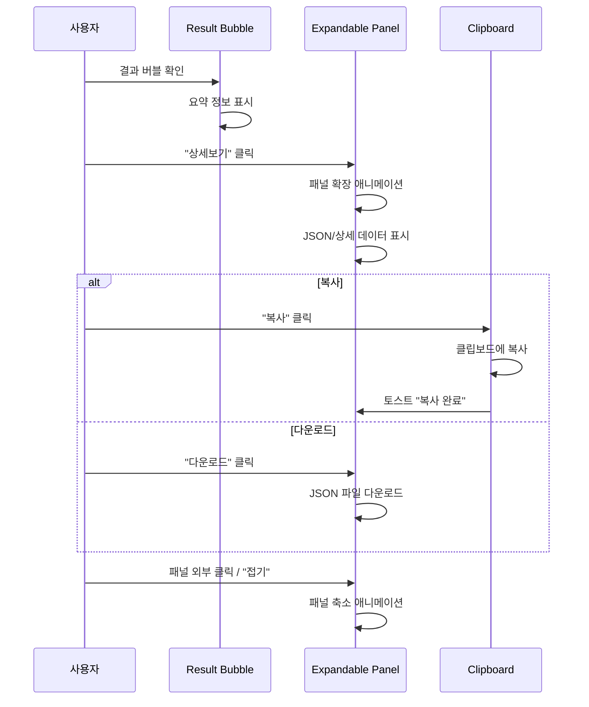

# Chrome Agent UI/UX 상세 설계

> **문서 버전:** 1.0  
> **작성일:** 2025-01-10  
> **상위 문서:** Chrome Agent PRD v1.0

---

## 1. UI 컴포넌트 개요

### 1.1 전체 UI 구성



---

## 2. 크롬 확장 프로그램 UI

### 2.1 Popup 와이어프레임

```
┌────────────────────────────────────────────┐
│ ┌────────────────────────────────────────┐ │
│ │  🔌 Chrome Agent            ● 연결됨   │ │ ← [A] Header
│ └────────────────────────────────────────┘ │
├────────────────────────────────────────────┤
│                                            │
│  ┌──────────────────────────────────────┐  │
│  │ 🤖 서버                     10:30 AM │  │ ← [B] Server Message
│  │                                      │  │
│  │ 현재 페이지의 쿠키를 추출합니다.       │  │
│  └──────────────────────────────────────┘  │
│                                            │
│  ┌──────────────────────────────────────┐  │
│  │         ◐  실행 중...                │  │ ← [C] Loading State
│  │                                      │  │
│  │    쿠키 정보를 가져오는 중입니다       │  │
│  └──────────────────────────────────────┘  │
│                                            │
│  ┌──────────────────────────────────────┐  │
│  │ ✅ 완료                     10:30 AM │  │ ← [D] Result Message
│  │                                      │  │
│  │ 5개의 쿠키를 추출했습니다.            │  │
│  │                                      │  │
│  │ ┌──────────────────────────────────┐ │  │
│  │ │ 📋 결과 상세보기                 │ │  │ ← [E] Expandable Result
│  │ └──────────────────────────────────┘ │  │
│  └──────────────────────────────────────┘  │
│                                            │ ← [F] Message Area
│                                            │     (Scrollable)
├────────────────────────────────────────────┤
│ ┌────────────────────────────────────────┐ │
│ │  서버: ws://localhost:8080             │ │ ← [G] Server URL
│ ├────────────────────────────────────────┤ │
│ │  [ 🔗 연결 ]     [ ⛓️‍💥 연결 해제 ]      │ │ ← [H] Action Buttons
│ └────────────────────────────────────────┘ │
└────────────────────────────────────────────┘

크기: 400px (W) x 500px (H)
```

### 2.2 컴포넌트 상세 명세

#### [A] Header 컴포넌트

| 요소 | 설명 | 스타일 |
|------|------|--------|
| 로고/타이틀 | "🔌 Chrome Agent" | font-size: 16px, font-weight: 600 |
| 상태 인디케이터 | 연결 상태 표시 | 아래 상태 인디케이터 참조 |

#### [B] Server Message 컴포넌트

```
┌─────────────────────────────────────────────┐
│ 🤖 서버                           10:30 AM  │ ← 발신자 + 시간
├─────────────────────────────────────────────┤
│                                             │
│ {메시지 내용}                                │ ← 메시지 본문
│                                             │
└─────────────────────────────────────────────┘

배경색: #F3F4F6 (gray-100)
테두리: 1px solid #E5E7EB (gray-200)
border-radius: 12px
padding: 12px 16px
margin: 8px 0
```

#### [C] Loading State 컴포넌트

```
┌─────────────────────────────────────────────┐
│                                             │
│              ◐                              │ ← SVG 스피너 (회전)
│                                             │
│         실행 중...                           │ ← 상태 텍스트
│                                             │
│   쿠키 정보를 가져오는 중입니다               │ ← 상세 설명
│                                             │
│   ████████████░░░░░░░░  60%                 │ ← 진행률 (선택적)
│                                             │
└─────────────────────────────────────────────┘

배경색: #EEF2FF (indigo-50)
border: 1px dashed #6366F1 (indigo-500)
```

#### [D] Result Message 컴포넌트

**성공 상태:**
```
┌─────────────────────────────────────────────┐
│ ✅ 완료                           10:30 AM  │
├─────────────────────────────────────────────┤
│ 5개의 쿠키를 추출했습니다.                    │
└─────────────────────────────────────────────┘

배경색: #ECFDF5 (green-50)
border-left: 4px solid #10B981 (green-500)
```

**실패 상태:**
```
┌─────────────────────────────────────────────┐
│ ❌ 오류                           10:30 AM  │
├─────────────────────────────────────────────┤
│ 선택자와 일치하는 요소를 찾을 수 없습니다.     │
│                                             │
│ [🔄 다시 시도]                               │
└─────────────────────────────────────────────┘

배경색: #FEF2F2 (red-50)
border-left: 4px solid #EF4444 (red-500)
```

#### [E] Expandable Result 컴포넌트

```
┌─────────────────────────────────────────────┐
│ 📋 결과 상세보기                        ▼   │ ← 접힌 상태
└─────────────────────────────────────────────┘

         ↓ 클릭 시 펼침

┌─────────────────────────────────────────────┐
│ 📋 결과 상세보기                        ▲   │
├─────────────────────────────────────────────┤
│ ┌─────────────────────────────────────────┐ │
│ │ {                                       │ │
│ │   "cookies": [                          │ │
│ │     {                                   │ │
│ │       "name": "session_id",             │ │
│ │       "value": "abc123...",             │ │
│ │       ...                               │ │
│ │     }                                   │ │
│ │   ]                                     │ │
│ │ }                                       │ │
│ └─────────────────────────────────────────┘ │
│                                             │
│ [📋 복사]                                    │
└─────────────────────────────────────────────┘

코드 영역 배경: #1F2937 (gray-800)
코드 텍스트: #F9FAFB (gray-50)
font-family: 'Fira Code', monospace
```

#### [G][H] Footer/Settings 컴포넌트

```
┌─────────────────────────────────────────────┐
│  서버 주소                                   │
│  ┌───────────────────────────────────────┐  │
│  │ ws://localhost:8080                   │  │ ← 입력 필드
│  └───────────────────────────────────────┘  │
│                                             │
│  ┌─────────────┐    ┌─────────────────┐     │
│  │  🔗 연결    │    │  ⛓️‍💥 연결 해제   │     │ ← 버튼
│  └─────────────┘    └─────────────────────┘     │
└─────────────────────────────────────────────┘

연결 버튼: bg-indigo-600, hover:bg-indigo-700
연결 해제 버튼: bg-gray-200, hover:bg-gray-300
```

---

## 3. 명령 에이전트 UI

### 3.1 전체 레이아웃 와이어프레임

```
┌──────────────────────────────────────────────────────────────────┐
│ ┌──────────────────────────────────────────────────────────────┐ │
│ │  🤖 Chrome Agent Commander                      ● 연결됨     │ │ ← [A] Header
│ │                                                  [⚙️ 설정]   │ │
│ └──────────────────────────────────────────────────────────────┘ │
├──────────────────────────────────────────────────────────────────┤
│ ┌──────────────────────────────────────────────────────────────┐ │
│ │                        시스템 상태                            │ │ ← [B] Status Bar
│ │  🟢 서버 연결됨  │  🟢 크롬 확장 연결됨  │  ⏱️ 응답시간: 120ms │ │
│ └──────────────────────────────────────────────────────────────┘ │
├──────────────────────────────────────────────────────────────────┤
│                                                                  │
│  ┌────────────────────────────────────────────────────────────┐  │
│  │ 👤 사용자                                        10:28 AM  │  │
│  │                                                            │  │
│  │ 현재 페이지에서 로그인 폼의 정보를 추출해줘                   │  │
│  └────────────────────────────────────────────────────────────┘  │
│                                                                  │
│  ┌────────────────────────────────────────────────────────────┐  │
│  │ 🤖 AI 어시스턴트                                 10:28 AM  │  │
│  │                                                            │  │
│  │ 네, 로그인 폼 정보를 추출하겠습니다.                         │  │
│  │                                                            │  │
│  │ ┌────────────────────────────────────────────────────────┐ │  │
│  │ │ 🔄 크롬 확장에서 실행 중...                             │ │  │ ← [C] Inline Status
│  │ │    ◐ EXTRACT_FORM 명령 처리 중                         │ │  │
│  │ └────────────────────────────────────────────────────────┘ │  │
│  └────────────────────────────────────────────────────────────┘  │
│                                                                  │
│  ┌────────────────────────────────────────────────────────────┐  │
│  │ 🤖 AI 어시스턴트                                 10:28 AM  │  │
│  │                                                            │  │
│  │ ✅ Form 정보를 성공적으로 추출했습니다.                      │  │
│  │                                                            │  │
│  │ ┌────────────────────────────────────────────────────────┐ │  │
│  │ │ 📋 추출 결과                                           │ │  │
│  │ ├────────────────────────────────────────────────────────┤ │  │
│  │ │ Form 정보                                              │ │  │
│  │ │ • Action: /api/auth/login                              │ │  │
│  │ │ • Method: POST                                         │ │  │
│  │ │ • Encoding: application/x-www-form-urlencoded          │ │  │
│  │ │                                                        │ │  │
│  │ │ 필드 목록 (3개)                                         │ │  │
│  │ │ ┌────────────────────────────────────────────────────┐ │ │  │
│  │ │ │ 1. username                                        │ │ │  │
│  │ │ │    Type: text │ Required: ✅ │ Value: ""           │ │ │  │
│  │ │ ├────────────────────────────────────────────────────┤ │ │  │
│  │ │ │ 2. password                                        │ │ │  │
│  │ │ │    Type: password │ Required: ✅ │ Value: ""       │ │ │  │
│  │ │ ├────────────────────────────────────────────────────┤ │ │  │
│  │ │ │ 3. _csrf                                           │ │ │  │
│  │ │ │    Type: hidden │ Required: ❌ │ Value: "tk_..."   │ │ │  │
│  │ │ └────────────────────────────────────────────────────┘ │ │  │
│  │ │                                                        │ │  │
│  │ │ [📋 JSON 복사]  [📥 다운로드]                           │ │  │
│  │ └────────────────────────────────────────────────────────┘ │  │
│  └────────────────────────────────────────────────────────────┘  │
│                                                                  │ ← [D] Chat Area
│                                                                  │     (Scrollable)
├──────────────────────────────────────────────────────────────────┤
│ ┌──────────────────────────────────────────────────────────────┐ │
│ │ 💡 예시: "쿠키 추출해줘", "상품 목록 가져와", "폼 정보 확인"    │ │ ← [E] Suggestion Bar
│ └──────────────────────────────────────────────────────────────┘ │
├──────────────────────────────────────────────────────────────────┤
│ ┌────────────────────────────────────────────────────┐ ┌──────┐ │
│ │ 메시지를 입력하세요...                              │ │ 전송 │ │ ← [F] Input Area
│ └────────────────────────────────────────────────────┘ └──────┘ │
└──────────────────────────────────────────────────────────────────┘

크기: 100% width (min: 600px, max: 1200px), 100vh height
```

### 3.2 반응형 레이아웃

#### Desktop (≥1024px)
```
┌──────────────────────────────────────────────────────────────────┐
│                           Header                                 │
├────────────────────────────────────┬─────────────────────────────┤
│                                    │                             │
│          Chat Area                 │      Result Panel           │
│          (Messages)                │      (상세 결과 표시)        │
│                                    │                             │
├────────────────────────────────────┴─────────────────────────────┤
│                         Input Area                               │
└──────────────────────────────────────────────────────────────────┘
```

#### Tablet (768px ~ 1023px)
```
┌────────────────────────────────────┐
│              Header                │
├────────────────────────────────────┤
│                                    │
│           Chat Area                │
│                                    │
├────────────────────────────────────┤
│           Input Area               │
└────────────────────────────────────┘
Result Panel → Modal/Drawer로 표시
```

#### Mobile (< 768px)
```
┌──────────────────────┐
│       Header         │
├──────────────────────┤
│                      │
│     Chat Area        │
│                      │
├──────────────────────┤
│    Input Area        │
└──────────────────────┘
간소화된 메시지 버블
```

---

## 4. 상태 인디케이터 시스템

### 4.1 연결 상태 인디케이터



#### 상태별 UI 표시

| 상태 | 아이콘 | 색상 | 텍스트 | 애니메이션 |
|------|--------|------|--------|-----------|
| `disconnected` | ⚫ | `#6B7280` (gray-500) | 연결 안됨 | 없음 |
| `connecting` | 🟡 | `#F59E0B` (amber-500) | 연결 중... | pulse |
| `connected` | 🟢 | `#10B981` (green-500) | 연결됨 | 없음 |
| `reconnecting` | 🟠 | `#F97316` (orange-500) | 재연결 중... | pulse |
| `error` | 🔴 | `#EF4444` (red-500) | 연결 오류 | 없음 |

#### CSS 애니메이션

```css
/* Pulse 애니메이션 */
@keyframes pulse {
  0%, 100% {
    opacity: 1;
  }
  50% {
    opacity: 0.5;
  }
}

.status-connecting,
.status-reconnecting {
  animation: pulse 1.5s ease-in-out infinite;
}

/* 인디케이터 기본 스타일 */
.status-indicator {
  width: 10px;
  height: 10px;
  border-radius: 50%;
  display: inline-block;
  margin-right: 6px;
}
```

---

### 4.2 명령 실행 상태 인디케이터



#### 상태별 UI 표시

| 상태 | 아이콘 | 설명 | 인디케이터 |
|------|--------|------|-----------|
| `idle` | - | 대기 중 | 없음 |
| `sending` | ⏳ | 서버로 전송 중 | 스피너 |
| `processing` | 🔄 | AI 처리 중 | 스피너 + 텍스트 |
| `executing` | ⚙️ | 브라우저에서 실행 중 | 스피너 + 진행률 |
| `success` | ✅ | 완료 | 체크마크 (1초 후 사라짐) |
| `error` | ❌ | 실패 | 에러 아이콘 |
| `timeout` | ⏱️ | 시간 초과 | 시계 아이콘 |

---

### 4.3 로딩 인디케이터 컴포넌트

#### 스피너 타입

```
Type A: 회전 스피너 (기본)
      ◐ → ◓ → ◑ → ◒ → ◐

Type B: 점 스피너 (인라인용)
      ●○○ → ○●○ → ○○● → ●○○

Type C: 바 스피너 (진행률 표시)
      ████████░░░░░░░░ 50%
```

#### SVG 스피너 코드

```svg
<!-- Type A: 회전 스피너 -->
<svg class="spinner" width="24" height="24" viewBox="0 0 24 24">
  <circle 
    cx="12" cy="12" r="10" 
    stroke="#6366F1" 
    stroke-width="3" 
    fill="none"
    stroke-dasharray="31.4 31.4"
    stroke-linecap="round">
    <animateTransform
      attributeName="transform"
      type="rotate"
      from="0 12 12"
      to="360 12 12"
      dur="1s"
      repeatCount="indefinite"/>
  </circle>
</svg>
```

```css
/* 스피너 크기 변형 */
.spinner-sm { width: 16px; height: 16px; }
.spinner-md { width: 24px; height: 24px; }
.spinner-lg { width: 32px; height: 32px; }
```

---

## 5. 크롬 확장 프로그램 상태 전이

### 5.1 전체 상태 머신



### 5.2 Popup UI 상태 전이



---

## 6. 명령 에이전트 상태 전이

### 6.1 전체 상태 머신



### 6.2 메시지 상태 전이



---

## 7. 인터랙션 패턴

### 7.1 메시지 전송 플로우



### 7.2 결과 확장/축소 플로우



---

## 8. 토스트 알림 시스템

### 8.1 토스트 타입

```
┌─────────────────────────────────────────┐
│ ✅  연결되었습니다                    ✕  │  ← Success
└─────────────────────────────────────────┘
배경: #ECFDF5, 테두리: #10B981

┌─────────────────────────────────────────┐
│ ❌  연결에 실패했습니다               ✕  │  ← Error
└─────────────────────────────────────────┘
배경: #FEF2F2, 테두리: #EF4444

┌─────────────────────────────────────────┐
│ ⚠️  크롬 확장 연결을 확인해주세요      ✕  │  ← Warning
└─────────────────────────────────────────┘
배경: #FFFBEB, 테두리: #F59E0B

┌─────────────────────────────────────────┐
│ ℹ️  클립보드에 복사되었습니다          ✕  │  ← Info
└─────────────────────────────────────────┘
배경: #EFF6FF, 테두리: #3B82F6
```

### 8.2 토스트 동작

| 속성 | 값 |
|------|-----|
| 위치 | 우측 상단 |
| 표시 시간 | 3초 (에러: 5초) |
| 최대 개수 | 3개 (스택) |
| 애니메이션 | slide-in-right, fade-out |

---

## 9. 에러 상태 UI

### 9.1 연결 에러 화면

```
┌────────────────────────────────────────┐
│                                        │
│              ⚠️                        │
│                                        │
│      서버에 연결할 수 없습니다           │
│                                        │
│  서버가 실행 중인지 확인해주세요.        │
│  주소: ws://localhost:8080             │
│                                        │
│         ┌──────────────────┐           │
│         │    🔄 재연결     │           │
│         └──────────────────┘           │
│                                        │
│         ┌──────────────────┐           │
│         │   ⚙️ 설정 변경   │           │
│         └──────────────────┘           │
│                                        │
└────────────────────────────────────────┘
```

### 9.2 명령 실행 에러

```
┌────────────────────────────────────────────────────┐
│ ❌ 명령 실행 실패                        10:30 AM  │
├────────────────────────────────────────────────────┤
│                                                    │
│ 오류 코드: ELEMENT_NOT_FOUND                        │
│                                                    │
│ 선택자 ".product-item"와 일치하는 요소를            │
│ 찾을 수 없습니다.                                   │
│                                                    │
│ 💡 해결 방법:                                       │
│ • 페이지가 완전히 로드되었는지 확인하세요            │
│ • 선택자가 올바른지 확인하세요                       │
│ • 다른 선택자를 시도해보세요                         │
│                                                    │
│ ┌────────────────┐  ┌────────────────┐             │
│ │   🔄 다시 시도  │  │   📋 로그 복사  │             │
│ └────────────────┘  └────────────────┘             │
└────────────────────────────────────────────────────┘
```

---

## 10. 디자인 토큰

### 10.1 색상 시스템

```css
:root {
  /* Primary */
  --color-primary-50: #EEF2FF;
  --color-primary-100: #E0E7FF;
  --color-primary-500: #6366F1;
  --color-primary-600: #4F46E5;
  --color-primary-700: #4338CA;
  
  /* Gray */
  --color-gray-50: #F9FAFB;
  --color-gray-100: #F3F4F6;
  --color-gray-200: #E5E7EB;
  --color-gray-500: #6B7280;
  --color-gray-700: #374151;
  --color-gray-800: #1F2937;
  --color-gray-900: #111827;
  
  /* Status */
  --color-success: #10B981;
  --color-warning: #F59E0B;
  --color-error: #EF4444;
  --color-info: #3B82F6;
}
```

### 10.2 타이포그래피

```css
:root {
  /* Font Family */
  --font-sans: 'Pretendard', -apple-system, BlinkMacSystemFont, sans-serif;
  --font-mono: 'Fira Code', 'JetBrains Mono', monospace;
  
  /* Font Size */
  --text-xs: 12px;
  --text-sm: 14px;
  --text-base: 16px;
  --text-lg: 18px;
  --text-xl: 20px;
  
  /* Font Weight */
  --font-normal: 400;
  --font-medium: 500;
  --font-semibold: 600;
  --font-bold: 700;
  
  /* Line Height */
  --leading-tight: 1.25;
  --leading-normal: 1.5;
  --leading-relaxed: 1.75;
}
```

### 10.3 간격 시스템

```css
:root {
  --space-1: 4px;
  --space-2: 8px;
  --space-3: 12px;
  --space-4: 16px;
  --space-5: 20px;
  --space-6: 24px;
  --space-8: 32px;
  --space-10: 40px;
  --space-12: 48px;
}
```

### 10.4 그림자

```css
:root {
  --shadow-sm: 0 1px 2px 0 rgba(0, 0, 0, 0.05);
  --shadow-md: 0 4px 6px -1px rgba(0, 0, 0, 0.1);
  --shadow-lg: 0 10px 15px -3px rgba(0, 0, 0, 0.1);
  --shadow-xl: 0 20px 25px -5px rgba(0, 0, 0, 0.1);
}
```

### 10.5 Border Radius

```css
:root {
  --radius-sm: 4px;
  --radius-md: 8px;
  --radius-lg: 12px;
  --radius-xl: 16px;
  --radius-full: 9999px;
}
```

---

## 11. 접근성 (Accessibility)

### 11.1 키보드 네비게이션

| 키 | 동작 |
|-----|------|
| `Tab` | 다음 포커스 요소로 이동 |
| `Shift + Tab` | 이전 포커스 요소로 이동 |
| `Enter` | 메시지 전송 / 버튼 클릭 |
| `Escape` | 모달/드롭다운 닫기 |
| `↑` `↓` | 메시지 히스토리 탐색 (입력창) |

### 11.2 ARIA 레이블

```html
<!-- 연결 상태 -->
<span 
  role="status" 
  aria-live="polite"
  aria-label="서버 연결 상태: 연결됨">
  ● 연결됨
</span>

<!-- 로딩 상태 -->
<div 
  role="status" 
  aria-live="polite" 
  aria-busy="true"
  aria-label="명령 실행 중">
  <svg class="spinner">...</svg>
  실행 중...
</div>

<!-- 채팅 영역 -->
<div 
  role="log" 
  aria-live="polite" 
  aria-label="채팅 메시지">
  ...
</div>
```

### 11.3 색상 대비

모든 텍스트는 WCAG 2.1 AA 기준 충족:
- 일반 텍스트: 최소 4.5:1
- 대형 텍스트: 최소 3:1

---

## 변경 이력

| 버전 | 날짜 | 변경 내용 |
|------|------|-----------|
| 1.0 | 2025-01-10 | UI/UX 상세 설계 초안 작성 |
